# AFA Architecture

How the platform is put together, what runs where, and — in the most detail —
how the **model/strategy layer** works, since that is the part you extend.

Companion documents:

- **[STRATEGIES.md](STRATEGIES.md)** — the plug-and-play guide to creating,
  updating and deleting strategies.
- **[QUANT_RESEARCH.md](QUANT_RESEARCH.md)** — the research basis for each
  strategy and risk model.

## Contents

- [The one-paragraph version](#the-one-paragraph-version)
- [System overview](#system-overview)
- [The strategy layer](#the-strategy-layer)
  - [The interface](#the-interface)
  - [The three dispatch paths](#the-three-dispatch-paths)
  - [Registry and configuration flow](#registry-and-configuration-flow)
  - [Ensembles (UMAs)](#ensembles-umas)
  - [The ML strategy and the training loop](#the-ml-strategy-and-the-training-loop)
  - [Self-learning weights](#self-learning-weights)
- [The backtest engine](#the-backtest-engine)
- [The live agent](#the-live-agent)
- [Concurrency map](#concurrency-map)
- [Device selection](#device-selection)
- [Report generation and data lineage](#report-generation-and-data-lineage)
- [Determinism guarantees](#determinism-guarantees)
- [Module map](#module-map)

## The one-paragraph version

Cached OHLCV parquet files are turned into feature matrices by a **feature
registry**, scored by a **strategy** looked up from a **strategy registry**,
sized and gated by **risk and compliance** rules, and written out as Excel
reports. The same strategy object is used by the live agent and the backtest
engine, so a strategy cannot behave one way in a backtest and another way
live. Everything expensive — data loading, per-ticker Monte Carlo, model
training, model inference — is parallelized, but always in a way that leaves
results identical to the serial path.

## System overview

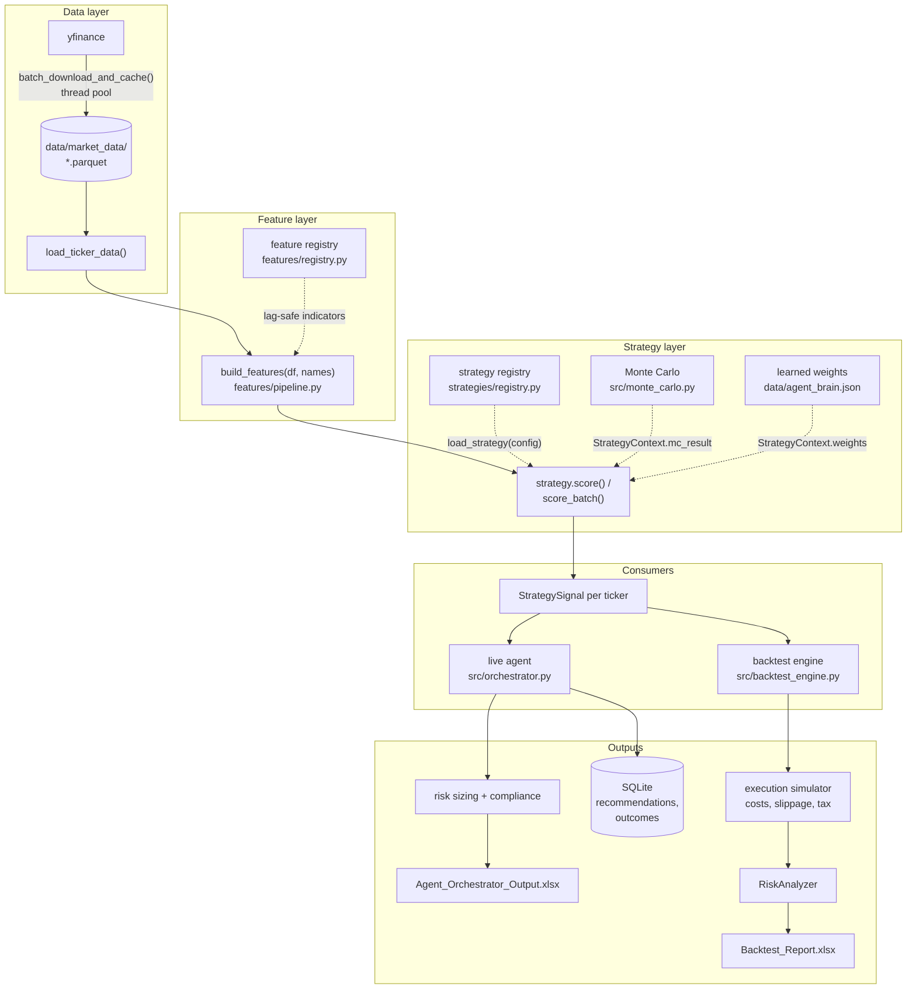

The important structural property is the **single scoring path**: both
consumers call the same `BaseStrategy` object built by the same registry from
the same config. There is no separate "backtest scoring" implementation to
drift out of sync with the live one.

## The strategy layer

### The interface

Every strategy — built-in or yours — implements one small interface.

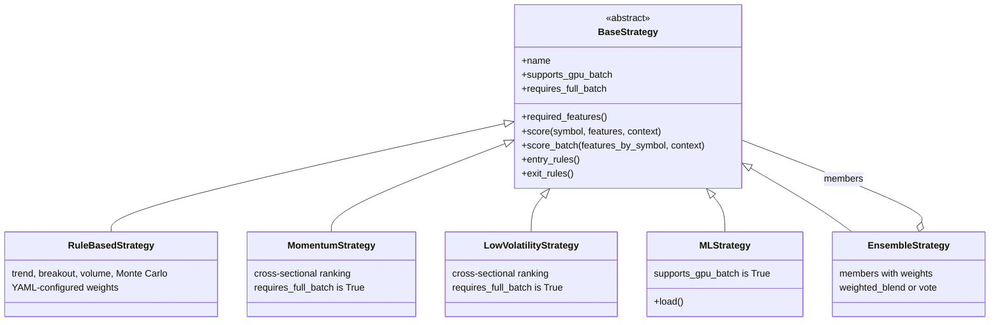

Only three members are mandatory: `name`, `required_features()`, and
`score()`. The two boolean properties are how a strategy tells its callers how
it wants to be invoked.

Inputs and outputs are fixed shapes (`strategies/types.py`):

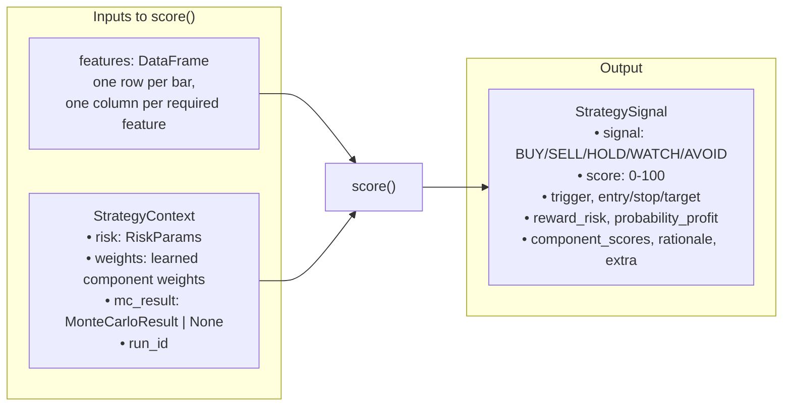

`rationale` is not decoration — it is what lands in the Excel report's
rationale column and explains to a human why a ticker did or did not qualify.

### The three dispatch paths

A caller picks **one** of three ways to score a universe, based on the two
boolean properties. This is the single most important diagram for
understanding strategy performance:

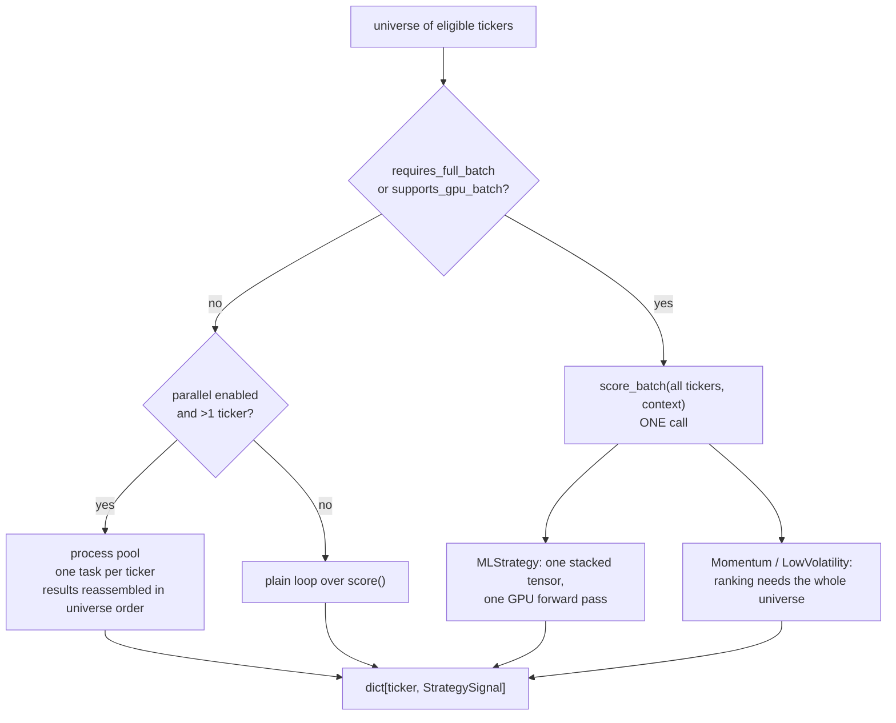

The two flags mean different things and should not be confused:

| Property | Means | Set by | Consequence of getting it wrong |
|---|---|---|---|
| `supports_gpu_batch` | "`score_batch()` is a genuine batched forward pass" | `MLStrategy` | Performance only — you lose GPU batching |
| `requires_full_batch` | "my signal depends on ranking against the whole universe" | `MomentumStrategy`, `LowVolatilityStrategy` | **Correctness** — ranking against a universe of one is meaningless |

A cross-sectional strategy scored one ticker at a time is not slow, it is
wrong: the top decile of a single stock is always that stock.

### Registry and configuration flow

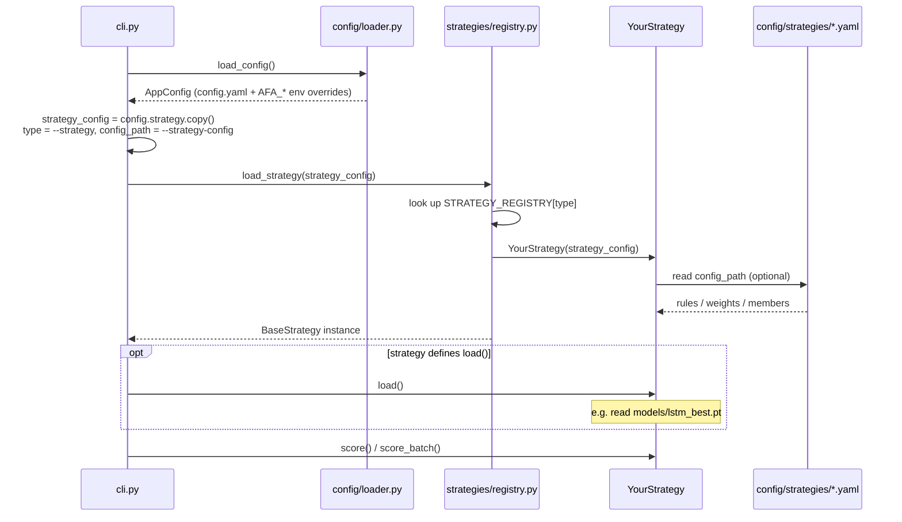

The registry is explicit — `register_strategy("name", Class)` — rather than
import-scanning, so the set of available strategies is knowable statically and
`portfolio-agent list-strategies` can never lie.

### Ensembles (UMAs)

A UMA is itself just a strategy, so it can be backtested, run live, or nested
inside another UMA.

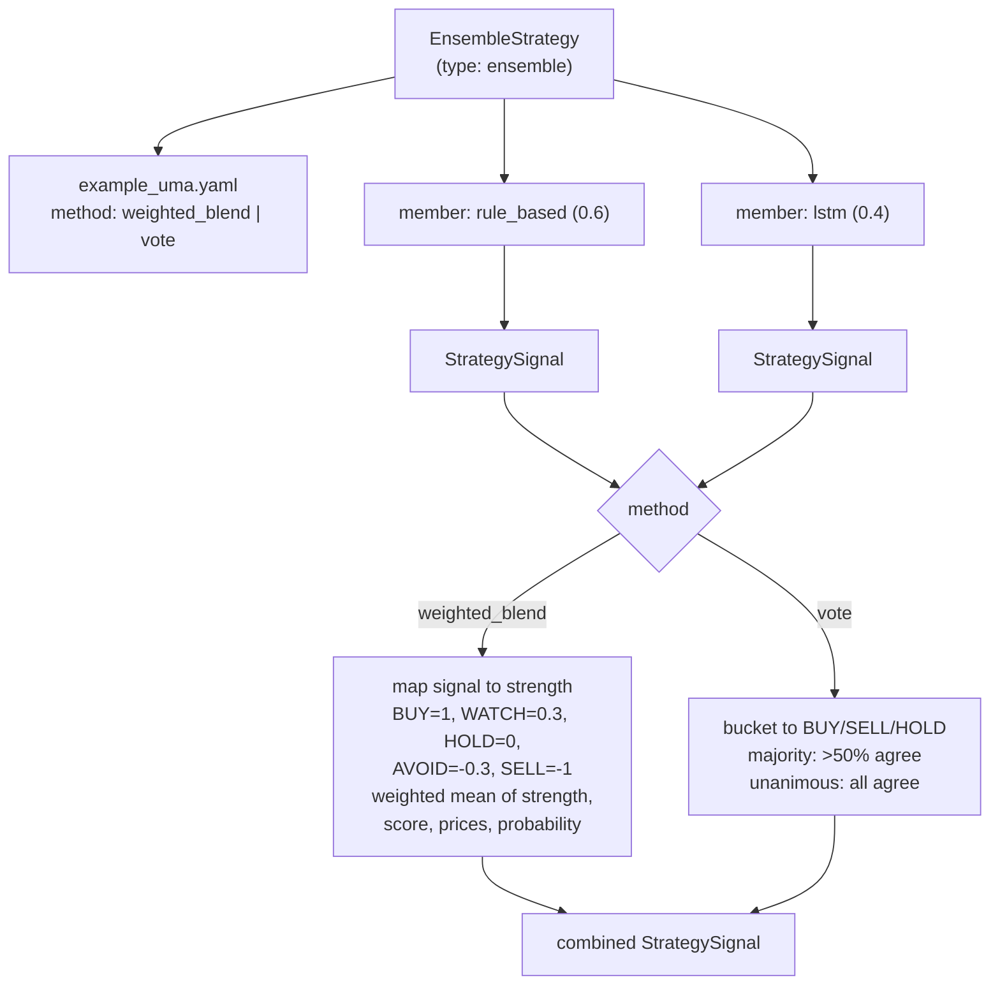

Two consequences worth knowing:

- A UMA is **not** GPU-batched even when a member is. Members are scored
  per-ticker so that a rule-based member receives its genuine per-ticker Monte
  Carlo result. For maximum ML throughput, run that strategy directly.
- Cross-sectional strategies (`momentum`, `low_volatility`) **cannot** be UMA
  members, because a UMA scores members per-ticker and their ranking would
  degenerate.

### The ML strategy and the training loop

Training and inference are two separate programs joined by a checkpoint and a
metadata file:

```mermaid
flowchart LR
    subgraph train["portfolio-agent train"]
        direction TB
        T1["resolve universe"] --> T2["per-ticker load + featurize<br/>process pool"]
        T2 --> T3["70/15/15 split per ticker,<br/>then concatenate"]
        T3 --> T4["TimeSeriesDataset<br/>sliding windows"]
        T4 --> T5["DataLoader<br/>pin_memory on CUDA"]
        T5 --> T6["train loop<br/>AMP on CUDA, early stopping"]
    end

    T6 --> CKPT[("models/lstm_best.pt")]
    T6 --> META[("models/metadata.json<br/>feature_names, target,<br/>sequence_length")]

    subgraph infer["backtest / run-agent with --strategy lstm"]
        direction TB
        L["ModelLoader.load_model()"] --> RF["required_features()<br/>= metadata feature_names"]
        RF --> BF["build_features per ticker"]
        BF --> STACK["stack last sequence_length rows<br/>for every eligible ticker"]
        STACK --> FWD["ONE forward pass<br/>(n_tickers, seq_len, n_features)"]
        FWD --> P["prediction -> probability -> signal"]
    end

    CKPT --> L
    META --> L
```

`metadata.json` is the contract between the two halves: the feature list the
model was trained on becomes the feature list the strategy requests at
inference time, so the two can never silently disagree.

Panel construction detail worth knowing: each ticker is split 70/15/15
*individually* and then all train parts are concatenated, followed by all
validation parts, then all test parts. That ordering makes the dataloader's
single top-level 70/15/15 index split land exactly on those boundaries, so
validation and test represent every ticker rather than only the last few.

### Self-learning weights

The rule-based scoring components carry weights that adapt to realized
outcomes. The same pure function drives both the live agent and the backtest,
so learning cannot drift between them.

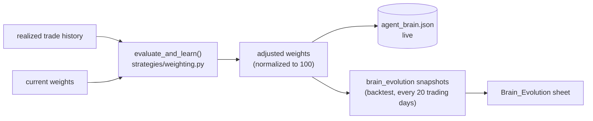

## The backtest engine

Each trading day is replayed in real market order. The ordering is not
cosmetic: it is what keeps the equity curve honest and prevents look-ahead.

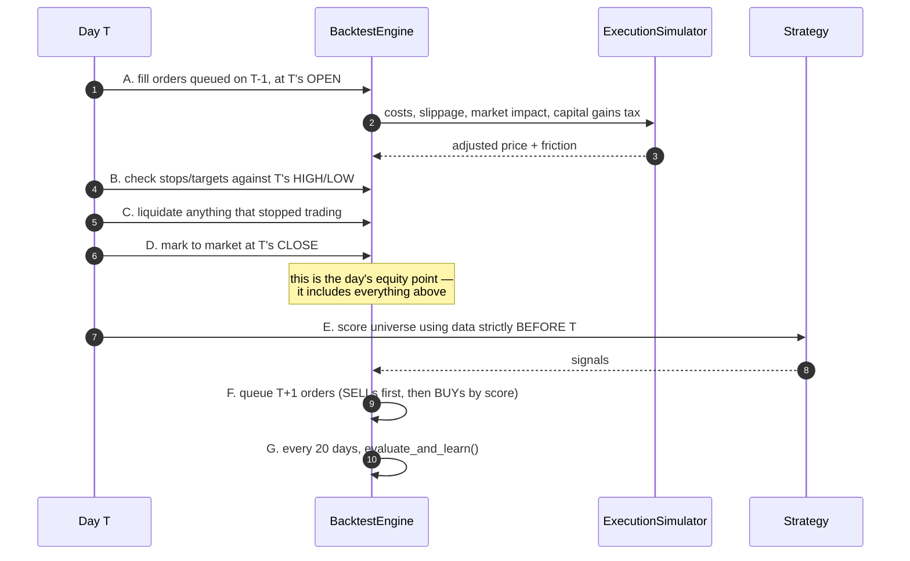

Look-ahead prevention is structural, not incidental:

- Signals for day T are computed from `df[df.index < T]` — strictly earlier bars.
- Orders decided on day T execute at **T+1's open**, never at a price known
  when the decision was made.
- Position sizing uses T's end-of-day equity, which is known before T+1's open.

Position accounting is tracked explicitly in `open_positions` (cost basis,
first entry date, quantity), which is what makes realized P&L, holding period
and STCG/LTCG classification correct in the trade log.

## The live agent

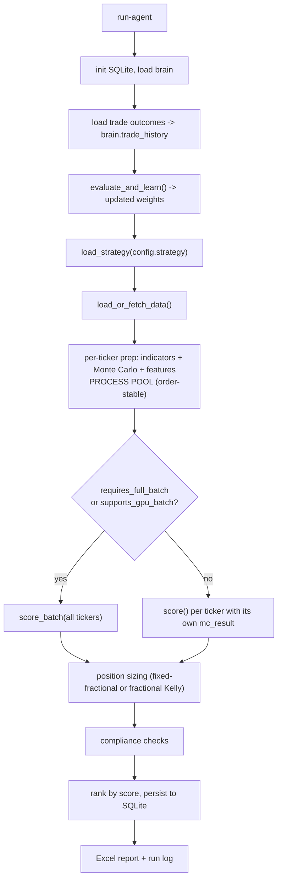

## Concurrency map

Each hot path uses the executor that matches the work, and every one of them
is result-identical to its serial equivalent.

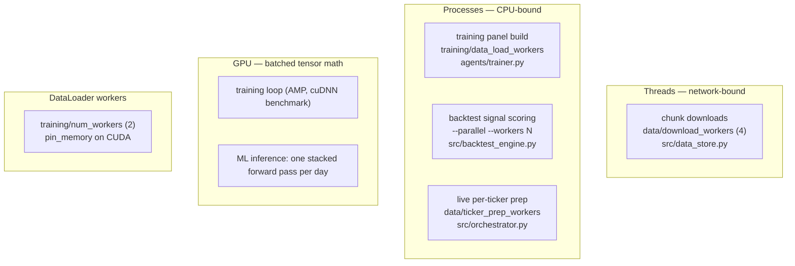

| Path | Executor | Why | Knob |
|---|---|---|---|
| Market data download | `ThreadPoolExecutor` | Blocked on sockets; the GIL is released during I/O, and processes would only add pickling cost | `data.download_workers`, `download-data --workers` |
| Training panel build | `ProcessPoolExecutor` | Parquet decode + indicator math is CPU-bound Python | `training.parallel_data_loading`, `training.data_load_workers` |
| Backtest signal scoring | `ProcessPoolExecutor` | Monte Carlo + indicator math per ticker per day | `backtest --parallel --workers N` |
| Live per-ticker prep | `ProcessPoolExecutor` | Same work as above, once per run | `data.parallel_ticker_prep`, `data.ticker_prep_workers` |
| Batch tensor training | GPU | Matrix math | `training.device`, `use_mixed_precision`, `use_torch_compile` |
| ML inference | GPU | All eligible tickers in one forward pass | `backtest --device cuda` |
| Batch feeding | DataLoader workers | Overlaps host-side batch prep with device compute | `training.num_workers` |

Two design rules keep this safe:

1. **The pool is per run, not per unit of work.** The backtest engine creates
   one worker pool for the whole run and installs the run-constant inputs
   (strategy, feature list, risk params, Monte Carlo settings) through a pool
   initializer. Only the per-day varying arguments travel with each task.
2. **Results are reassembled in input order**, never in completion order — see
   [Determinism guarantees](#determinism-guarantees).

## Device selection

One resolver decides the device, and it never hands back an accelerator that
PyTorch cannot actually use.

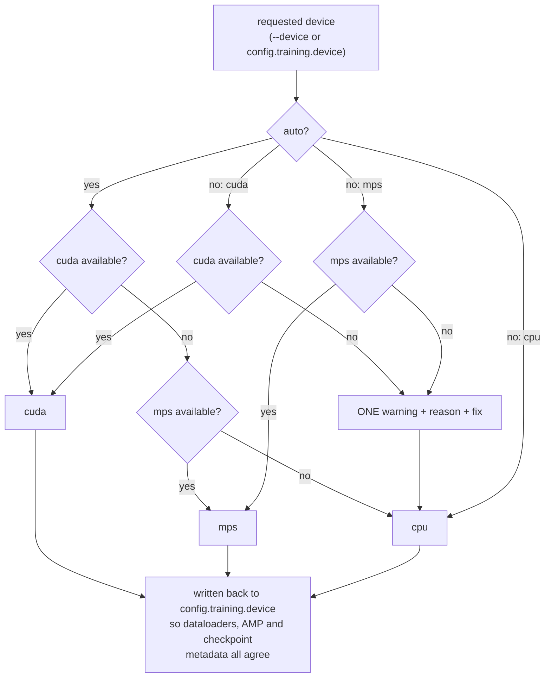

When CUDA is requested but unavailable, the diagnostic distinguishes the cases
that need different fixes:

| Symptom | Meaning | Fix |
|---|---|---|
| `torch.version.cuda is None` | CPU-only PyTorch wheel — what PyPI ships for Windows, so `uv sync --extra gpu` alone is not enough | Install a CUDA build from the PyTorch index |
| Built with CUDA, `CUDA_VISIBLE_DEVICES` empty | GPUs hidden from this process | Unset the variable |
| Built with CUDA, no device visible | Missing/older driver, or no NVIDIA GPU | Update the driver, or install a build for an older CUDA |

Run `portfolio-agent gpu-check` to see which case applies.

## Report generation and data lineage

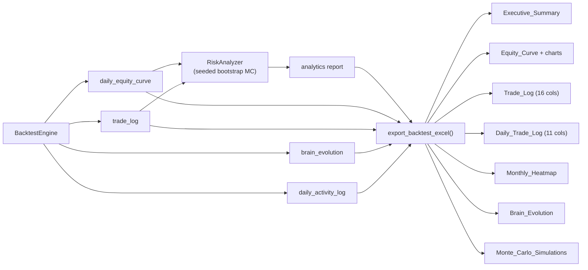

Two contracts govern the numbers that reach Excel:

- **Units.** Every percentage metric crosses the boundary in *percent* units
  (`18.5` means 18.5%), declared per metric in
  `backtest_reporting.py::SUMMARY_METRICS`. The exporter divides by 100 once,
  because Excel percent formats multiply by 100 on display. Ratios (Sharpe,
  Sortino, profit factor) are written as plain numbers.
- **Columns.** `EXPECTED_COLUMNS` (16) and `EXPECTED_DAILY_COLUMNS` (11) are
  the only trade-log schemas. Values are written at looked-up column indices,
  never hardcoded positions.

Realized P&L reads `net_pnl` and counts only **closed round trips** — an open
BUY leg carries `exit_date: None` and a negative P&L (its transaction cost),
and counting it would report every open position as a losing trade.

## Determinism guarantees

The same inputs produce the same report, whether or not you pass `--parallel`
and no matter how many workers you use. Three mechanisms provide that:

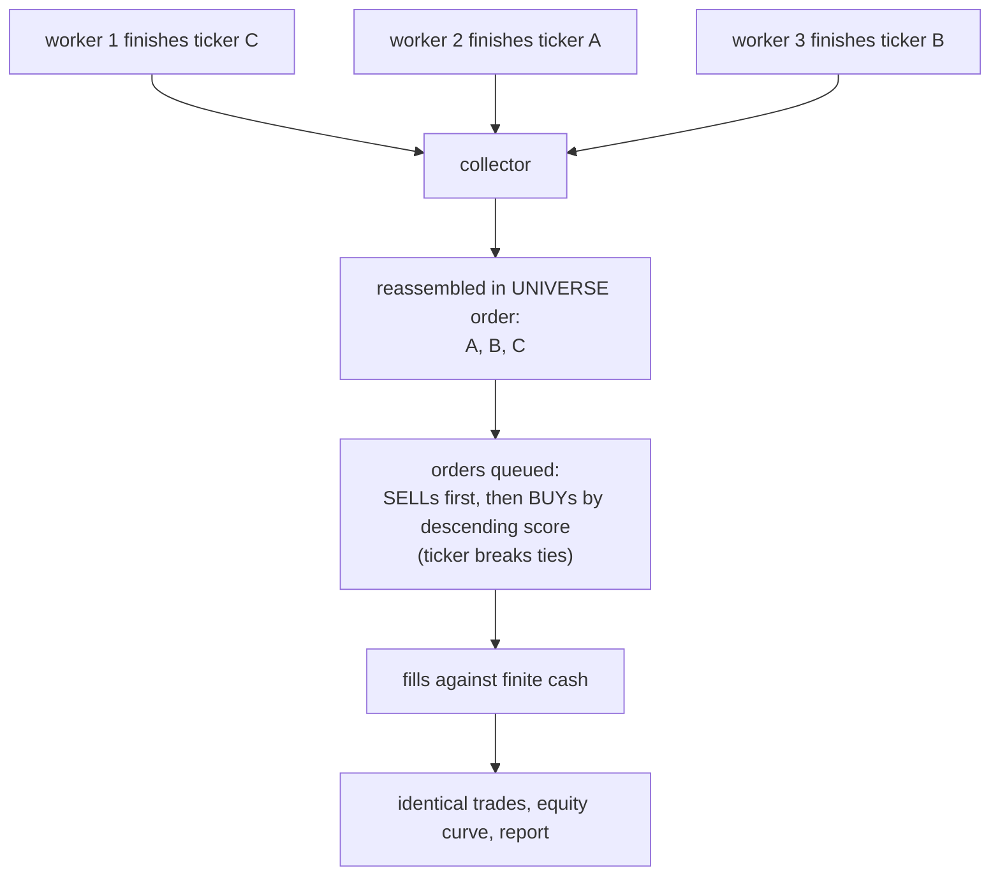

1. **Order-stable collection.** Parallel results are keyed by ticker and
   re-read in input order, so completion order never leaks into results. This
   matters because cash is finite: whichever BUY is considered first is the one
   that gets filled.
2. **Ranked order queueing.** BUY candidates are queued by descending signal
   score with the ticker as tie-breaker — reproducible, and the behaviour a
   capital-constrained portfolio wants anyway.
3. **Seeded simulations.** Both the per-symbol forward Monte Carlo and the
   portfolio-level bootstrap Monte Carlo are seeded (`simulation.random_seed`),
   and the bootstrap draws from a local generator so it neither disturbs nor
   depends on global NumPy state.

This is enforced by tests, not just convention: `tests/test_parallel_determinism.py`
runs the same backtest serially and in parallel and compares the exported
workbook sheet by sheet.

## Module map

```
portfolio_agent/
├── cli.py                  entry point: download-data, train, backtest,
│                           run-agent, list-strategies, gpu-check
├── config/
│   ├── schema.py           pydantic AppConfig (the full settings surface)
│   ├── loader.py           config.yaml + AFA_* env overrides
│   └── strategies/*.yaml   per-strategy rule files, incl. example_uma.yaml
├── features/
│   ├── registry.py         @register_feature name -> function
│   ├── technical.py        the lag-safe indicators themselves
│   └── pipeline.py         build_features(df, names) -> DataFrame
├── strategies/
│   ├── base.py             BaseStrategy — the interface you implement
│   ├── types.py            RiskParams, StrategyContext, StrategySignal
│   ├── registry.py         register_strategy / load_strategy
│   ├── rule_based.py       trend + breakout + volume + Monte Carlo
│   ├── cross_sectional.py  momentum, low_volatility (requires_full_batch)
│   ├── ml_strategy.py      trained model, GPU-batched (supports_gpu_batch)
│   ├── ensemble.py         UMAs: weighted_blend / vote
│   └── weighting.py        pure weight-adaptation used live and in backtests
├── models/
│   ├── registry.py         @register_model name -> nn.Module class
│   └── pytorch_models.py   LSTM forecaster
├── agents/
│   ├── trainer.py          training loop, panel construction, checkpointing
│   └── backtester.py       wires strategy -> engine -> analytics -> Excel
├── data/dataset.py         TimeSeriesDataset + DataLoader construction
├── utils/device.py         device resolution and GPU diagnostics
└── src/
    ├── orchestrator.py     the live daily loop
    ├── backtest_engine.py  event-driven backtest
    ├── execution_sim.py    Indian market costs, slippage, STCG/LTCG
    ├── risk.py             position sizing incl. fractional Kelly
    ├── risk_analytics.py   CAGR/Sharpe/Sortino/drawdown, bootstrap MC
    ├── monte_carlo.py      per-symbol forward simulation (scoring input)
    ├── volatility_models.py GJR-GARCH(1,1)
    ├── compliance.py       eligibility gates
    ├── data_store.py       parquet cache + downloads
    ├── universe.py         ticker universe resolution
    ├── reporting.py        live-agent Excel report
    └── backtest_reporting.py backtest Excel report
```

Note the two distinct Monte Carlo modules — they answer different questions:

| | `src/monte_carlo.py` | `src/risk_analytics.py` |
|---|---|---|
| Scope | one symbol | whole portfolio |
| Direction | forward from today | resampling of realized trades |
| Role | **input** to strategy scoring | **output** metric in the report |
| Method | lognormal shocks (optionally GARCH-driven) | bootstrap resampling of trade returns |
