# AFA Architecture

How the platform is put together, what runs where, and — in the most detail —
how the **model/strategy layer** works, since that is the part you extend.

Companion documents:

- **[STRATEGIES.md](STRATEGIES.md)** — the plug-and-play guide to creating,
  updating and deleting strategies.
- **[QUANT_RESEARCH.md](QUANT_RESEARCH.md)** — the research basis for each
  strategy and risk model.

## Contents

- [The one-paragraph version](#the-one-paragraph-version)
- [System overview](#system-overview)
- [The strategy layer](#the-strategy-layer)
  - [The interface](#the-interface)
  - [The three dispatch paths](#the-three-dispatch-paths)
  - [Registry and configuration flow](#registry-and-configuration-flow)
  - [Ensembles (UMAs)](#ensembles-umas)
  - [The trigger engine](#the-trigger-engine)
  - [The ML strategy and the training loop](#the-ml-strategy-and-the-training-loop)
  - [Self-learning weights](#self-learning-weights)
- [The backtest engine](#the-backtest-engine)
- [The live agent](#the-live-agent)
- [Concurrency map](#concurrency-map)
- [Device selection](#device-selection)
- [Report generation and data lineage](#report-generation-and-data-lineage)
- [Determinism guarantees](#determinism-guarantees)
- [Module map](#module-map)

## The one-paragraph version

Cached OHLCV parquet files are turned into feature matrices by a **feature
registry**, scored by a **strategy** looked up from a **strategy registry**,
sized and gated by **risk and compliance** rules, and written out as Excel
reports. When several strategies are combined, a **trigger engine** arbitrates
their verdicts rather than averaging them, and a **market regime** decides
which of them may speak at all. The same strategy object is used by the live
agent and the backtest engine, so a strategy cannot behave one way in a
backtest and another way live. Everything expensive — data loading, per-ticker
Monte Carlo, model training, model inference — is parallelized, but always in a
way that leaves results identical to the serial path.

## System overview

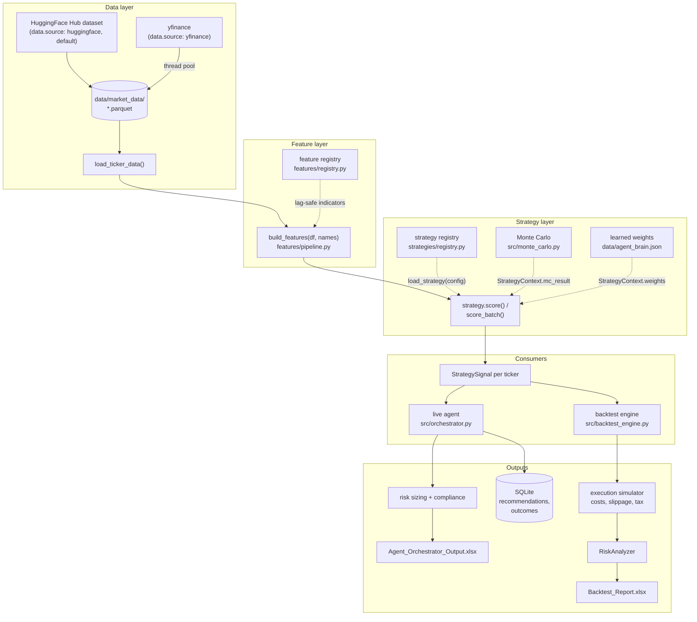

The important structural property is the **single scoring path**: both
consumers call the same `BaseStrategy` object built by the same registry from
the same config. There is no separate "backtest scoring" implementation to
drift out of sync with the live one.

## The strategy layer

### The interface

Every strategy — built-in or yours — implements one small interface.

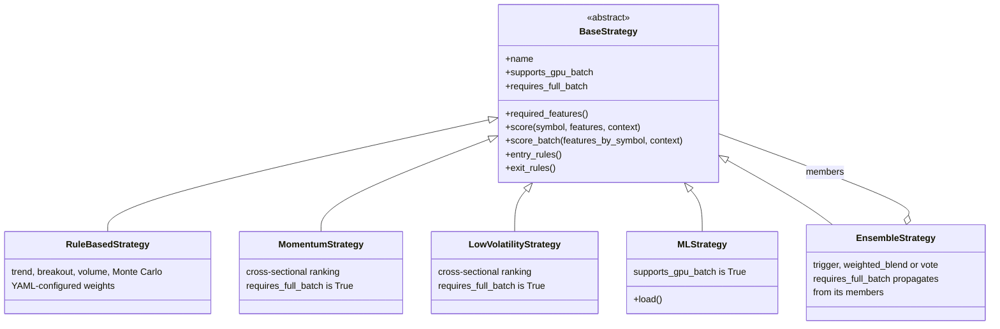

Only three members are mandatory: `name`, `required_features()`, and
`score()`. The two boolean properties are how a strategy tells its callers how
it wants to be invoked.

Inputs and outputs are fixed shapes (`strategies/types.py`):

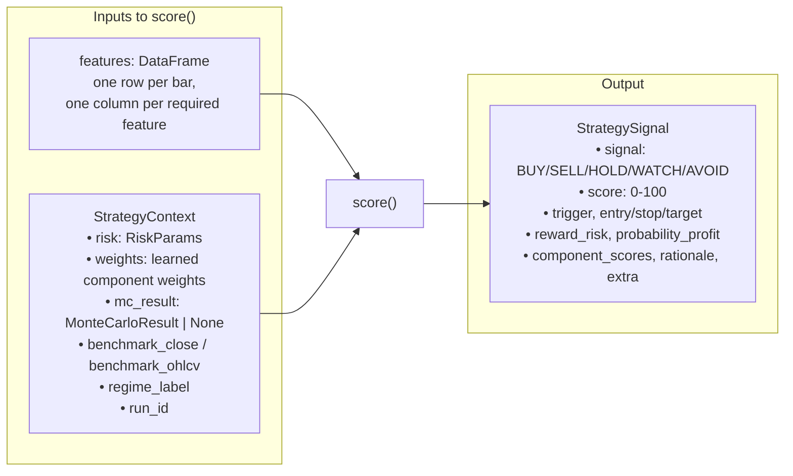

`rationale` is not decoration — it is what lands in the Excel report's
rationale column and explains to a human why a ticker did or did not qualify.

### The three dispatch paths

A caller picks **one** of three ways to score a universe, based on the two
boolean properties. This is the single most important diagram for
understanding strategy performance:

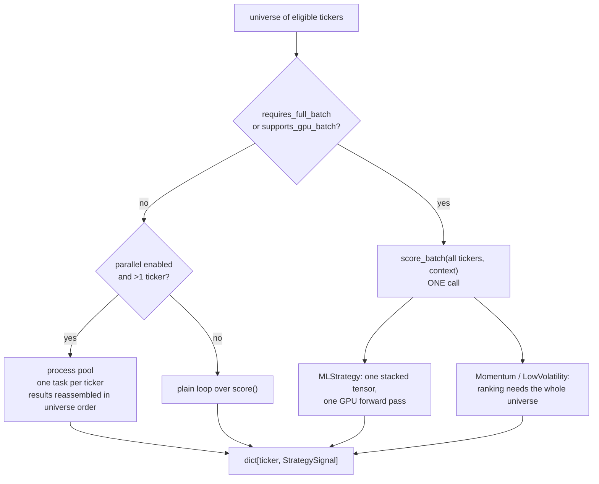

The two flags mean different things and should not be confused:

| Property | Means | Set by | Consequence of getting it wrong |
|---|---|---|---|
| `supports_gpu_batch` | "`score_batch()` is a genuine batched forward pass" | `MLStrategy` | Performance only — you lose GPU batching |
| `requires_full_batch` | "my signal depends on ranking against the whole universe" | `MomentumStrategy`, `LowVolatilityStrategy`, `RuleBasedStrategy` under `scoring.method: rank_composite` or `probit_composite`, and any `EnsembleStrategy` containing one | **Correctness** — ranking against a universe of one is meaningless |

A cross-sectional strategy scored one ticker at a time is not slow, it is
wrong: the top decile of a single stock is always that stock.

### Registry and configuration flow

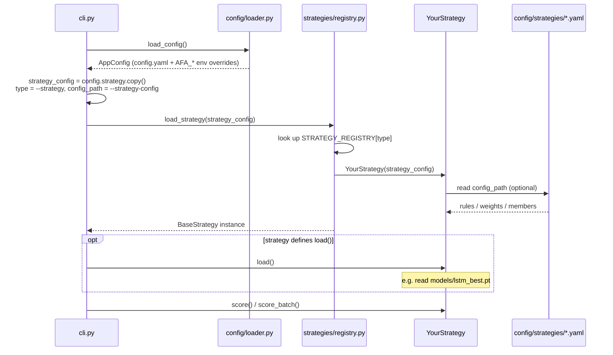

The registry is explicit — `register_strategy("name", Class)` — rather than
import-scanning, so the set of available strategies is knowable statically and
`portfolio-agent list-strategies` can never lie.

### Ensembles (UMAs)

A UMA is itself just a strategy, so it can be backtested, run live, or nested
inside another UMA.

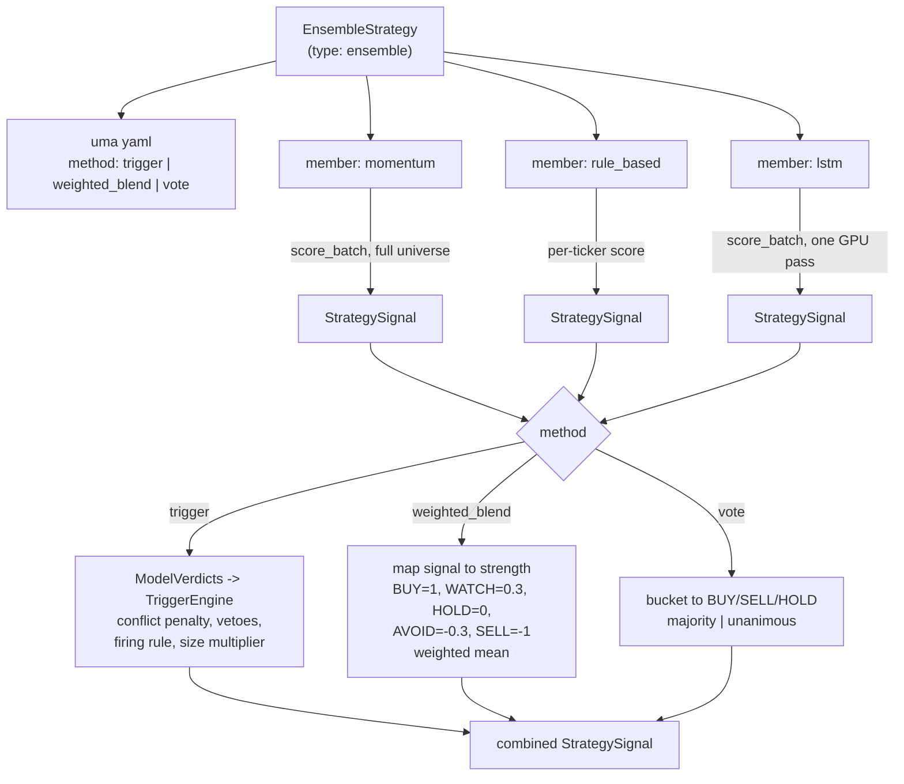

Each member is asked the way that member needs to be asked — cross-sectional
rankers and GPU-batched models get one `score_batch()` spanning the whole
eligible universe, everything else is looped per ticker — and only then are the
per-symbol results combined. That ordering is what lets a decile ranker be a
member at all: ranking is a statement about a cross-section, and a per-ticker
loop hands it a universe of one.

Three consequences worth knowing:

- Cross-sectional members require `method: trigger`. The averaging methods
  combine through per-ticker `score()`, so they reject such members at
  construction rather than quietly ranking each stock against itself.
- `context.mc_result` is per-ticker and batching callers build one context per
  round, so a `rule_based` member inside a batched UMA sees no Monte Carlo
  result and scores its `MC_Prob` component at zero.
- Members are addressed by the name the UMA file declares (`name:`, or
  `params.name`), because a rule-based member names itself from its own YAML
  and an ML member from its checkpoint. The `regimes:` map keys off those
  names, and duplicates are rejected — the trigger engine treats each verdict
  as an independent voice.

### The trigger engine

`src/trigger_engine.py` exists because averaging is the right operation for
*estimates of the same quantity* and the wrong operation for *votes on a
decision*. Blend a momentum model at BUY 0.90 with a mean-reversion model at
SELL 0.85 and the result is a mild BUY — a trade neither member would take,
entered exactly when the models disagree most, and then stopped out by
whichever of them was right.

Members are first flattened into a common contract:

```
StrategySignal  ──ModelVerdict.from_signal()──▶  ModelVerdict
(entry/stop/target,                              (action, confidence 0-1,
 strategy-specific 0-100 score)                   expected_net_ev_pct,
                                                  regime_compatible,
                                                  liquidity_pass)
```

`score` is a goodness scale in every strategy here, so a BUY's conviction is
`score/100` and a SELL's is its complement — a model emitting SELL at score 15
is 85% convinced, not 15%. Expected value is derived from the reward:risk the
signal already carries, which this platform computes *net* of friction, so the
cost stack is not charged twice. A model that cannot estimate an EV reports
`None`, not zero; otherwise the hurdle would bite hardest on the models most
honest about their uncertainty.

Arbitration then runs in a fixed order, vetoes before arithmetic:

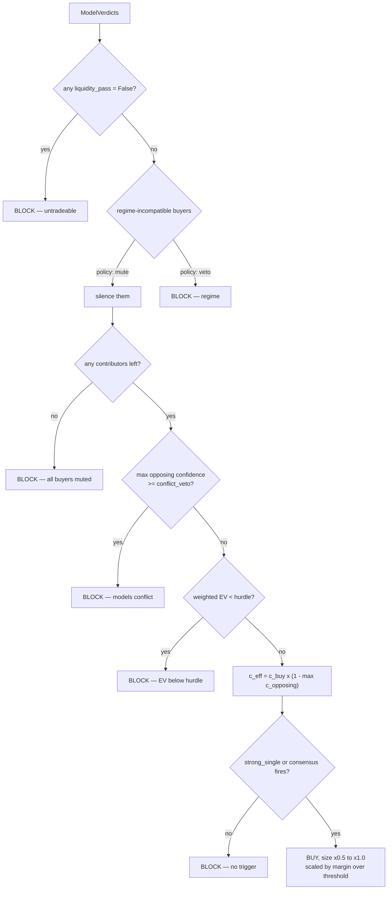

Two design choices are worth stating outright:

- **A regime-incompatible model is muted, not a veto.** A veto reading would
  mean any single out-of-season sleeve stands the whole book down, which makes
  the regime map useless. `regime_policy: veto` restores the strict reading.
- **What survives is a size, not a boolean.** A trade that only just clears its
  threshold is a trade the evidence only just supports; it is taken at
  `min_size_multiplier` (0.5 by default) and scales to full size at full
  conviction. The multiplier rides out on
  `StrategySignal.extra["position_scale"]` — the same channel cross-sectional
  volatility targeting already uses, so the backtest engine and live
  orchestrator honour it with no extra wiring.

The engine is stateless and pure, so a decision replays exactly from a logged
verdict list, and the live and backtest paths cannot drift.

### The ML strategy and the training loop

Training and inference are two separate programs joined by a checkpoint and a
metadata file:

```mermaid
flowchart LR
    subgraph train["portfolio-agent train"]
        direction TB
        T1["resolve universe"] --> T2["per-ticker load + featurize<br/>process pool"]
        T2 --> T3["70/15/15 split per ticker,<br/>then concatenate"]
        T3 --> T4["TimeSeriesDataset<br/>sliding windows"]
        T4 --> T5["DataLoader<br/>pin_memory on CUDA"]
        T5 --> T6["train loop<br/>AMP on CUDA, early stopping"]
    end

    T5 --> WF["walk-forward folds<br/>(out-of-sample predictions)"]
    WF --> CAL["isotonic calibration<br/>src/calibration.py"]
    T6 --> CKPT[("models/&lt;model&gt;_best.pt")]
    T6 --> META[("models/metadata.json<br/>feature_names, target, sequence_length,<br/>quantiles, n_outputs,<br/>confidence_calibration")]
    CAL --> META

    subgraph infer["backtest / evaluate with --strategy lstm"]
        direction TB
        L["ModelLoader.load_model()"] --> RF["required_features()<br/>= metadata feature_names"]
        RF --> BF["build_features per ticker"]
        BF --> STACK["stack last sequence_length rows<br/>for every eligible ticker"]
        STACK --> FWD["ONE forward pass<br/>(n_tickers, seq_len, n_features)"]
        FWD --> Q["sort quantiles<br/>q10 / q50 / q90"]
        Q --> P["calibrated probability -> signal;<br/>stop and target from q10 / q90"]
    end

    CKPT --> L
    META --> L
```

`metadata.json` is the contract between the two halves. The feature list the
model was trained on becomes the feature list the strategy requests at
inference time, so the two can never silently disagree — and the head shape
(`n_outputs`, `quantiles`) travels the same way, so inference rebuilds the
same architecture before loading the state dict. Metadata written before
quantile training existed carries neither key, and both default to the old
single-output shape, so old checkpoints keep loading.

The model predicts **three quantiles of the 5-day forward return, not one
number**. Squared error is minimized by the conditional mean, the conditional
mean of a 5-day return is nearly constant, and a network trained on it
converges to a near-constant output that validates beautifully and forecasts
nothing. Pinball loss over the 10th/50th/90th percentiles cannot be satisfied
by a constant, and the outer pair is a confidence interval that comes out of
the fit rather than being bolted on — `MLStrategy` derives its stop and target
from those percentiles instead of fixed cuts. See
[QUANT_RESEARCH.md §20](QUANT_RESEARCH.md#20-forecasting-a-distribution-instead-of-a-point).

The probability the strategy publishes is **calibrated**, not raw. Isotonic
regression fitted on the walk-forward test folds — the only genuinely
out-of-sample scores a run produces — maps score to realized win rate,
preserving the model's ranking while discarding its scale. That number feeds
Kelly sizing and the trigger engine's expected-value hurdle, both far more
sensitive to an optimistic probability than a pessimistic one.

Panel construction detail worth knowing: each ticker is split 70/15/15
*individually* and then all train parts are concatenated, followed by all
validation parts, then all test parts. That ordering makes the dataloader's
single top-level 70/15/15 index split land exactly on those boundaries, so
validation and test represent every ticker rather than only the last few.

### Self-learning weights

The rule-based scoring components carry weights that adapt to realized
outcomes. The same pure function drives both the live agent and the backtest,
so learning cannot drift between them.

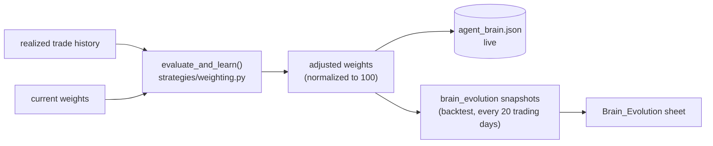

## The backtest engine

Each trading day is replayed in real market order. The ordering is not
cosmetic: it is what keeps the equity curve honest and prevents look-ahead.

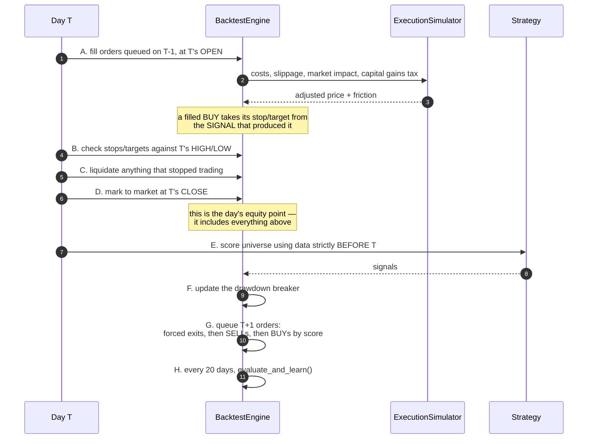

Look-ahead prevention is structural, not incidental:

- Signals for day T are computed from `df[df.index < T]` — strictly earlier bars.
- Orders decided on day T execute at **T+1's open**, never at a price known
  when the decision was made.
- Position sizing uses T's end-of-day equity, which is known before T+1's open.

Orders are scheduled for the next calendar weekday, which is sometimes a
market holiday; those fill at the **next session's** open. Everything due
today or earlier leaves the order book on that day's pass, filled or not, so
an order can neither be silently stranded nor retried indefinitely.

Position accounting is tracked explicitly in `open_positions` (cost basis,
first entry date, quantity), which is what makes realized P&L, holding period
and STCG/LTCG classification correct in the trade log.

### The exit plan belongs to the signal

A filled BUY's stop and target come from the `StrategySignal` that produced
it, carried on the order and re-applied by `_exit_levels()`. This used to be a
hardcoded 5% / 10% pair, and the consequences reached well past the exit:
`min_reward_risk` screened signals on a net-of-cost reward:risk computed from
ATR levels the engine then discarded, so the platform gated on one exit plan
and traded another.

**Distances, not levels.** The signal's levels are computed off T−1's close;
the fill lands at T+1's open plus slippage. Copying absolute levels across
would put a gapped-up entry immediately through its own target, so the
fractional distances are preserved and re-applied to the price actually paid.
A strategy supplying no usable stop still gets a documented fallback.

### Forced exits and the drawdown breaker

Two conditions invalidate a position's exit plan rather than merely arguing
against holding it, so they queue an exit outside the normal signal path:

| Trigger | Config | Why it overrides the stop |
|---|---|---|
| Holding closed at its **lower circuit** | `risk.exit_on_lower_circuit_lock` (on) | There is no bid, so the modelled stop is not a stop. Queued for the next session — the earliest a real order could work. |
| **Drawdown breaker** tripped | `risk.liquidate_on_drawdown_halt` (off) | Only when explicitly enabled; open positions otherwise keep their own stops. |

The breaker halts new BUYs at `max_portfolio_drawdown_pct` and re-arms on
recovery to `drawdown_reentry_pct` — **or** after `drawdown_halt_max_days`,
whichever comes first. The cooldown is not a nicety: halting buys does not
freeze the book, so open positions keep exiting through their stops until only
cash is left, and cash cannot appreciate back toward the peak it is measured
against. Recovery-only re-arming therefore deadlocks, silently, presenting as
a flat equity curve rather than an error. The cooldown resets the equity peak
on its way out, because leaving the old peak in place puts the next bar
straight back over the trip threshold.

## The live agent

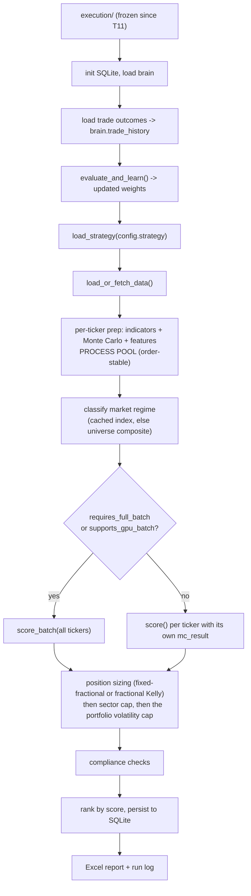

## Concurrency map

Each hot path uses the executor that matches the work, and every one of them
is result-identical to its serial equivalent.

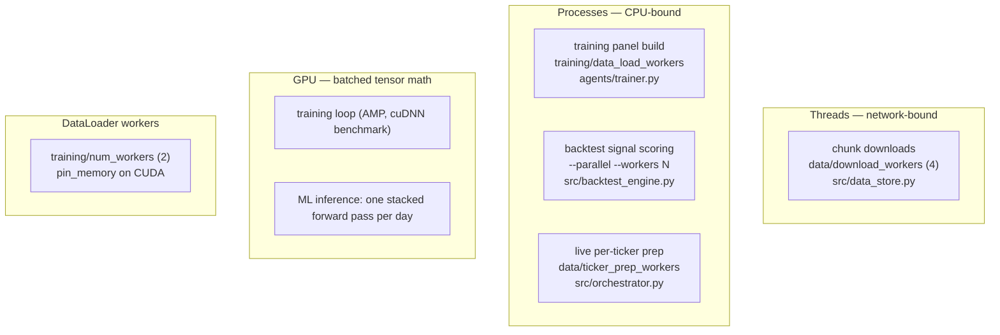

| Path | Executor | Why | Knob |
|---|---|---|---|
| Market data download | `ThreadPoolExecutor` | Blocked on sockets; the GIL is released during I/O, and processes would only add pickling cost | `data.download_workers`, `download-data --workers` |
| Training panel build | `ProcessPoolExecutor` | Parquet decode + indicator math is CPU-bound Python | `training.parallel_data_loading`, `training.data_load_workers` |
| Backtest signal scoring | `ProcessPoolExecutor` | Monte Carlo + indicator math per ticker per day | `backtest --parallel --workers N` |
| Live per-ticker prep | `ProcessPoolExecutor` | Same work as above, once per run | `data.parallel_ticker_prep`, `data.ticker_prep_workers` |
| Batch tensor training | GPU | Matrix math | `training.device`, `use_mixed_precision`, `use_torch_compile` |
| ML inference | GPU | All eligible tickers in one forward pass | `backtest --device cuda` |
| Batch feeding | DataLoader workers | Overlaps host-side batch prep with device compute | `training.num_workers` |

Two design rules keep this safe:

1. **The pool is per run, not per unit of work.** The backtest engine creates
   one worker pool for the whole run and installs the run-constant inputs
   (strategy, feature list, risk params, Monte Carlo settings) through a pool
   initializer. Only the per-day varying arguments travel with each task.
2. **Results are reassembled in input order**, never in completion order — see
   [Determinism guarantees](#determinism-guarantees).

## Device selection

One resolver decides the device, and it never hands back an accelerator that
PyTorch cannot actually use.

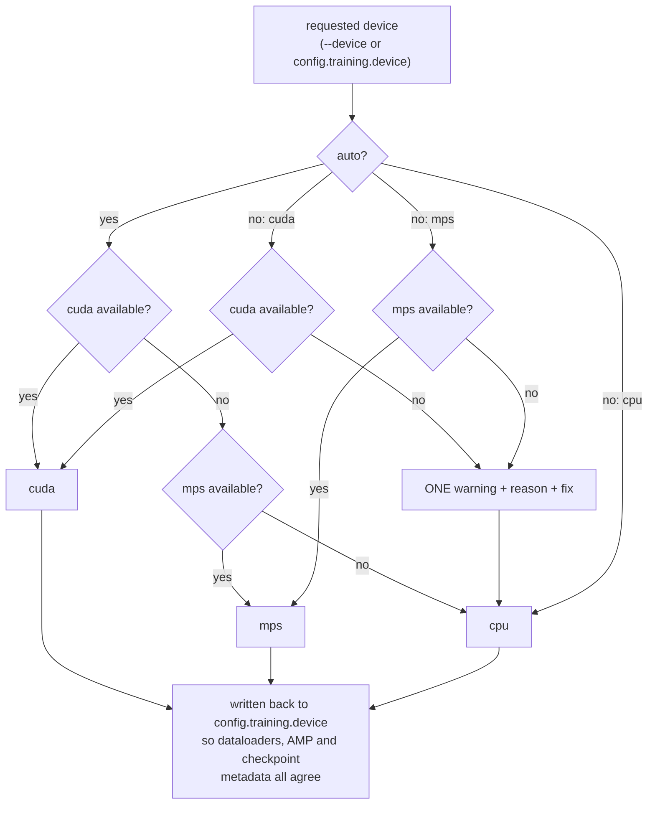

When CUDA is requested but unavailable, the diagnostic distinguishes the cases
that need different fixes:

| Symptom | Meaning | Fix |
|---|---|---|
| `torch.version.cuda is None` | CPU-only PyTorch wheel — what PyPI ships for Windows, so `uv sync --extra gpu` alone is not enough | Install a CUDA build from the PyTorch index |
| Built with CUDA, `CUDA_VISIBLE_DEVICES` empty | GPUs hidden from this process | Unset the variable |
| Built with CUDA, no device visible | Missing/older driver, or no NVIDIA GPU | Update the driver, or install a build for an older CUDA |

Run `portfolio-agent gpu-check` to see which case applies.

## Report generation and data lineage

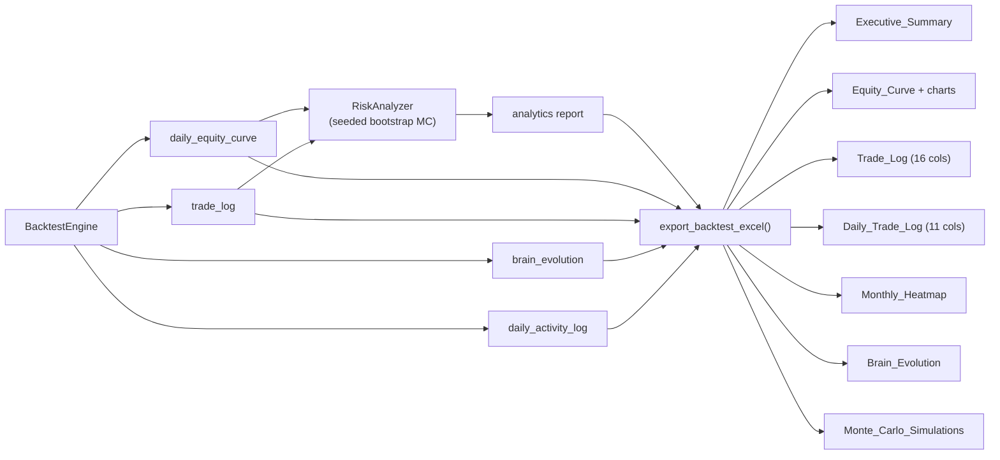

Two contracts govern the numbers that reach Excel:

- **Units.** Every percentage metric crosses the boundary in *percent* units
  (`18.5` means 18.5%), declared per metric in
  `src/backtest_reporting.py::SUMMARY_METRICS`. The exporter divides by 100 once,
  because Excel percent formats multiply by 100 on display. Ratios (Sharpe,
  Sortino, profit factor) are written as plain numbers.
- **Columns.** `EXPECTED_COLUMNS` (16) and `EXPECTED_DAILY_COLUMNS` (11) are
  the only trade-log schemas. Values are written at looked-up column indices,
  never hardcoded positions.

Realized P&L reads `net_pnl` and counts only **closed round trips** — an open
BUY leg carries `exit_date: None` and a negative P&L (its transaction cost),
and counting it would report every open position as a losing trade.

## Determinism guarantees

The same inputs produce the same report, whether or not you pass `--parallel`
and no matter how many workers you use. Three mechanisms provide that:

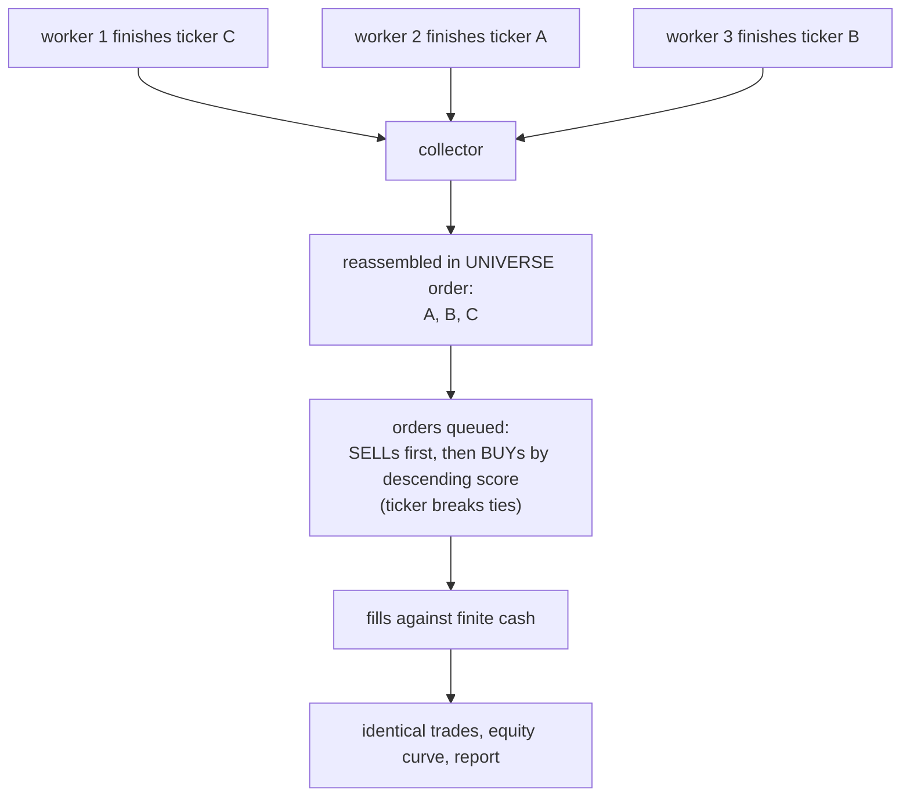

1. **Order-stable collection.** Parallel results are keyed by ticker and
   re-read in input order, so completion order never leaks into results. This
   matters because cash is finite: whichever BUY is considered first is the one
   that gets filled.
2. **Ranked order queueing.** BUY candidates are queued by descending signal
   score with the ticker as tie-breaker — reproducible, and the behaviour a
   capital-constrained portfolio wants anyway.
3. **Seeded simulations.** Both the per-symbol forward Monte Carlo and the
   portfolio-level bootstrap Monte Carlo are seeded (`simulation.random_seed`),
   and the bootstrap draws from a local generator so it neither disturbs nor
   depends on global NumPy state.
4. **Cross-sectional estimators are pure functions of the round.** The
   empirical drift prior, the per-date feature scaling and the probit composite
   introduce no randomness at all — they are arithmetic over a
   deterministically-ordered panel.

Two properties in that last group are easy to break by accident and are worth
stating explicitly, because neither fails loudly:

- **The drift prior travels per task, not through the pool initializer.** The
  scoring pool is created once per backtest and outlives the round it was built
  in, so installing the prior at worker startup would silently pin a 1,250-day
  run to day one's cross-section. It is four floats, so shipping it with each
  task costs nothing next to the history frame already being sent.
- **Trial identity hashes with SHA-256, never the builtin `hash()`.**
  `str.__hash__` is salted per process unless `PYTHONHASHSEED` is pinned, so a
  trial log keyed on it would count every re-run as a fresh trial, inflate N,
  and slowly over-deflate every Sharpe the platform reports — a drift that
  looks like a result rather than a bug.

This is enforced by tests, not just convention:
`portfolio_agent/tests/test_parallel_determinism.py` runs the same backtest
serially and in parallel and compares the exported workbook sheet by sheet, and
each estimator above has its own determinism test.

## Module map

```
portfolio_agent/
├── cli.py                  entry point: download-data, train, backtest,
│                           evaluate, compare, list-strategies, gpu-check
├── config/
│   ├── schema.py           pydantic AppConfig (the full settings surface)
│   ├── loader.py           config.yaml + AFA_* env overrides
│   └── strategies/*.yaml   per-strategy rule files, incl. example_uma.yaml
│                            and uma_meta_orchestrator.yaml (multi-regime)
├── features/
│   ├── registry.py         @register_feature name -> function
│   ├── technical.py        the lag-safe indicators themselves
│   ├── pipeline.py         build_features(df, names) -> DataFrame
│   └── scaling.py          model-input standardization: the checkpointed
│                           global scaler (a conditioning fix) and the
│                           per-date cross-sectional z-score (a statistical
│                           one, which fits no state and so cannot leak)
├── strategies/
│   ├── base.py             BaseStrategy — the interface you implement
│   ├── types.py            RiskParams, StrategyContext, StrategySignal, and
│   │                       ModelVerdict (the trigger engine's input contract)
│   ├── registry.py         register_strategy / load_strategy
│   ├── rule_based.py       trend + breakout + volume + Monte Carlo
│   ├── cross_sectional.py  momentum, low_volatility (requires_full_batch)
│   ├── ml_strategy.py      trained model, GPU-batched (supports_gpu_batch)
│   ├── india_sac.py        IndiaSACStrategy — continuous-action RL actor
│   │                       emitting an allocation weight in [0,1]; refuses
│   │                       to score without a trained checkpoint
│   ├── ensemble.py         UMAs: trigger / weighted_blend / vote
│   └── weighting.py        pure weight-adaptation used live and in backtests
├── models/
│   ├── registry.py         @register_model name -> nn.Module class
│   └── pytorch_models.py   LSTM and PatchTST forecasters, pinball loss
├── agents/
│   ├── trainer.py          training loop, panel construction, checkpointing
│   └── backtester.py       wires strategy -> engine -> analytics -> Excel
├── data/dataset.py         TimeSeriesDataset + DataLoader construction
├── utils/device.py         device resolution and GPU diagnostics
├── tests/                  the whole suite (pytest portfolio_agent/tests)
└── src/
    ├── orchestrator.py     the live daily loop
    ├── backtest_engine.py  event-driven backtest, incl. the exit plan a
    │                       filled order inherits from its signal
    ├── execution_sim.py    Indian market costs, slippage, STCG/LTCG,
    │                       plus the quantity-free round-trip cost estimator
    ├── risk.py             position sizing incl. fractional Kelly in
    │                       *allocation* units (capped at quarter-Kelly and
    │                       applied as a ceiling on the fixed-fractional risk
    │                       budget), Beta-shrunk win rate, net-of-cost RR
    ├── portfolio.py        covariance estimation (Ledoit-Wolf shrinkage, EW,
    │                       single-factor, and the two composed as
    │                       shrunk_ewma_covariance), portfolio risk
    │                       measurement, the projected-subgradient long-only
    │                       optimizer and HRP
    ├── portfolio_optimizer.py  the same mean-variance objective as a true QP
    │                       (cvxpy, optional extra), adding the one constraint
    │                       the subgradient solver cannot express: group /
    │                       sector limits. L1 turnover linearized with an
    │                       auxiliary variable
    ├── trigger_engine.py   signal arbitration: conflict penalty, vetoes,
    │                       firing modes, position-size multiplier
    ├── regime.py           market regime classification + volatility targeting
    ├── rl.py               RL exposure policy: environment, linear-softmax
    │                       policy, REINFORCE, walk-forward evaluation
    ├── markov_regime.py    K-state Gaussian HMM on the benchmark: Baum-Welch
    │                       fit, BIC state selection, filtered (never
    │                       smoothed) state probabilities, sleeve weighting
    ├── calibration.py      isotonic (PAVA) score -> probability calibration
    ├── liquidity.py        circuit-lock (1/2/5/10/20% bands), operator-trap
    │                       and illiquidity / zombie screening
    ├── sectors.py          ticker->sector map and concentration caps
    ├── risk_analytics.py   CAGR/Sharpe/Sortino/drawdown, bootstrap MC, and
    │                       the risk-free rate resolution: a dated T-bill
    │                       series when one is cached, otherwise the
    │                       configured constant, logging which it used
    ├── performance_stats.py PSR / deflated Sharpe / PBO / rank IC, the
    │                       Newey-West overlap correction, and the trial log
    │                       with its config-hash identity and deduplication
    ├── monte_carlo.py      per-symbol forward simulation (scoring input):
    │                       gaussian / block bootstrap / jump diffusion, with
    │                       the drift shrunk toward an empirical-Bayes prior
    │                       measured off the cross-section, and its
    │                       uncertainty propagated
    ├── volatility_models.py GJR-GARCH(1,1), incl. the gap-aware fit
    ├── compliance.py       eligibility gates
    ├── indicators.py       ATR/RSI/MACD/ADX and the IndicatorSnapshot the
    │                       live report reads
    ├── outcomes.py         trade-outcome marking that feeds the weight learner
    ├── storage.py          SQLite: recommendations, outcomes, brain, run log
    ├── data_store.py       parquet cache + source dispatch (Hub or yfinance)
    ├── hf_dataset.py       HuggingFace Hub OHLCV ingest + split adjustment
    ├── universe.py         ticker universe resolution
    ├── reporting.py        live-agent Excel report
    └── backtest_reporting.py backtest Excel report
```

Note the two distinct Monte Carlo modules — they answer different questions:

| | `src/monte_carlo.py` | `src/risk_analytics.py` |
|---|---|---|
| Scope | one symbol | whole portfolio |
| Direction | forward from today | resampling of realized trades |
| Role | **input** to strategy scoring | **output** metric in the report |
| Method | lognormal shocks (optionally GARCH-driven) | bootstrap resampling of trade returns |
