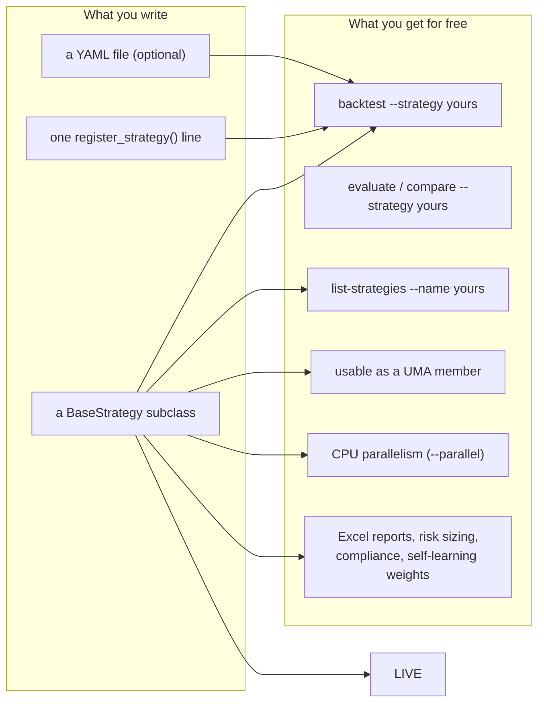
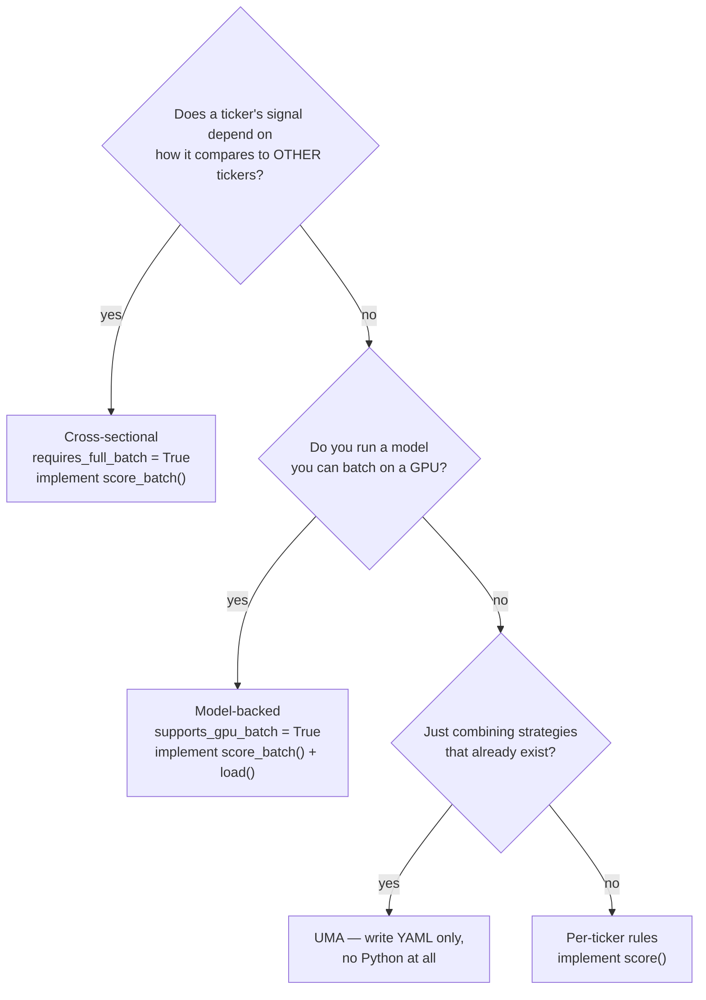
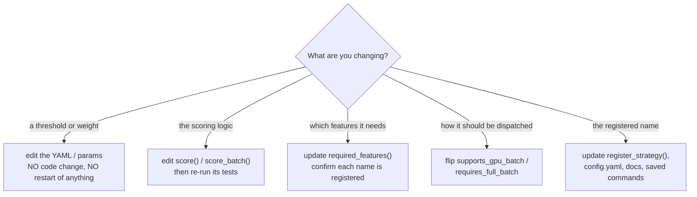
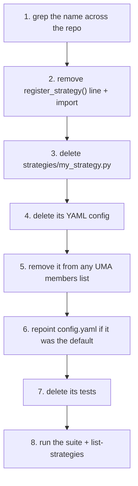

# Strategies: create, update, delete

A complete, plug-and-play guide to the strategy layer. Everything here is
additive: you drop in a file, register a name, and every command
(`evaluate`, `compare`, `backtest`, `list-strategies`, UMAs) picks it up. No
engine, evaluation or reporting code has to change.

For how the layer fits into the rest of the platform, see
**[ARCHITECTURE.md](ARCHITECTURE.md)**.

## Contents

- [The contract](#the-contract)
- [Create a strategy](#create-a-strategy)
  - [1. Pick your kind](#1-pick-your-kind)
  - [2. Write the class](#2-write-the-class)
  - [3. Register the name](#3-register-the-name)
  - [4. Add a YAML config (optional)](#4-add-a-yaml-config-optional)
  - [5. Run it](#5-run-it)
  - [6. Test it](#6-test-it)
- [Worked examples](#worked-examples)
  - [A. Per-ticker rule strategy](#a-per-ticker-rule-strategy)
  - [B. Cross-sectional ranking strategy](#b-cross-sectional-ranking-strategy)
  - [C. Model-backed strategy](#c-model-backed-strategy)
  - [D. Ensemble (UMA), no code at all](#d-ensemble-uma-no-code-at-all)
- [Update a strategy](#update-a-strategy)
- [Delete a strategy](#delete-a-strategy)
- [Add a feature](#add-a-feature)
- [Add a model architecture](#add-a-model-architecture)
- [Reference](#reference)
- [Checklists](#checklists)
- [Troubleshooting](#troubleshooting)

## The contract



You must implement three things:

| Member | Type | Purpose |
|---|---|---|
| `name` | `property -> str` | Display name, shown in reports and `list-strategies` |
| `required_features()` | `-> list[str]` | Feature names the caller should build for you — must all exist in the feature registry |
| `score(symbol, features, context)` | `-> StrategySignal` | Turn the latest feature row into a decision |

Optional members:

| Member | Default | Use when |
|---|---|---|
| `score_batch(features_by_symbol, context)` | loops over `score()` | You can score many tickers at once |
| `supports_gpu_batch` | `False` | `score_batch()` is a genuine batched GPU forward pass |
| `requires_full_batch` | `False` | Your signal ranks tickers against each other |
| `entry_rules()` / `exit_rules()` | `{}` | You want `list-strategies --name` to show them |
| `load()` | not defined | You need to load a checkpoint before scoring; returning `False` aborts the run with a clear error |

### Inputs

`features` is a DataFrame with one row per bar (chronological) and one column
per name from `required_features()`. **Read the last row** — it is the latest
lag-safe bar. In a backtest the caller has already truncated history to
strictly before the decision date, so you cannot see the future by accident.

`context` is a `StrategyContext`:

```python
context.risk            # RiskParams: target_prob_profit, min_reward_risk,
                        # min_price_inr, portfolio_value_inr, risk_per_trade_pct,
                        # max_single_position_pct, atr_stop_multiplier,
                        # atr_target_multiplier, buy_cost_pct, sell_cost_pct
context.weights         # learned component weights, e.g. {"Trend": 25.0, ...}
context.mc_result       # MonteCarloResult for this ticker, or None in batch paths
context.benchmark_close # market index close series (e.g. Nifty 50) truncated to
                        # before the decision date, or None when not cached
context.benchmark_ohlcv # the same index as an OHLC frame, when cached. Only ADX
                        # needs the daily range; None falls back to a close-only proxy
context.regime_label    # BULL_RISK_ON | BEAR_CRASH_RISK | SIDEWAYS_CHOP |
                        # NEUTRAL | UNKNOWN, classified once per scoring round
                        # so every strategy sees the same market state. None
                        # means "not assessed" — treat that as permissive
context.run_id          # correlation id for logging
```

`buy_cost_pct` / `sell_cost_pct` are estimated per-leg friction as a fraction of
turnover. Report `reward_risk` **net** of them — `src/risk.py::net_reward_risk()`
does the arithmetic — so the `min_reward_risk` gate compares money actually kept
rather than a gross ratio that flatters every trade.

> **Your `stop_price` and `target_price` are binding, not decorative.** The
> backtest engine sizes a filled position's exit levels from the signal that
> produced it (as distances re-applied to the fill price). Two consequences for
> anyone writing a strategy:
>
> - **Match the exit horizon to your signal's horizon.** A stop tight enough to
>   trigger in a couple of sessions turns a multi-month thesis into
>   day-trading, and pays ~0.8% of round-trip friction each time it does. The
>   built-in momentum sleeve lost 2.0% gross at a 1.5× ATR stop and made 4.4%
>   gross at 6.0× over the same data, purely from that.
> - **A stop at or above entry is discarded**, and the engine falls back to a
>   documented default rather than inverting your exit.

Two optional keys in `StrategySignal.extra` are read by the sizing layer, so a
strategy that measures its own risk environment does not have to reimplement
position sizing:

```python
extra={"position_scale": 0.5}   # multiplier in [0, 1] applied to the sized
                                # quantity by BOTH the backtest engine and the
                                # live orchestrator; used by cross_sectional.py
                                # for volatility targeting and the crash filter
```

`context.mc_result` is `None` on the batched paths. If your strategy needs a
genuine per-ticker Monte Carlo result, leave `supports_gpu_batch` and
`requires_full_batch` at `False` so you are scored per-ticker.

### Output

Return a `StrategySignal`. Every field lands somewhere a human reads:

```python
StrategySignal(
    symbol=symbol,
    signal="BUY",              # BUY | SELL | HOLD | WATCH | AVOID
    score=72.5,                # 0-100, used to rank and to break capital ties
    trigger="Trend",           # which component fired
    entry_price=close,
    stop_price=stop,
    target_price=target,
    reward_risk=2.0,
    probability_profit=0.61,   # 0-1
    component_scores={"Trend": 1.0},   # feeds the self-learning weights
    rationale="...",           # the report's rationale column — say why
    extra={},                  # anything else you want to carry along
)
```

`signal` drives behaviour, and only two values transact:

| Signal | Backtest engine | Live agent |
|---|---|---|
| `BUY` | queues a BUY for T+1 open (if not already held) | recommendation, sized and compliance-checked |
| `SELL` | queues a SELL for T+1 open (if held) | recommendation |
| `HOLD` / `WATCH` / `AVOID` | no order | recorded, ranked, reported |

**Never raise from `score()` for ordinary "cannot decide" cases** — return an
`AVOID` signal with a rationale instead. An exception is treated as a scoring
failure and the ticker is silently skipped that round.

## Create a strategy

### 1. Pick your kind



### 2. Write the class

Create `portfolio_agent/strategies/my_strategy.py`:

```python
"""Mean-reversion strategy: buy oversold names in an uptrend."""

from __future__ import annotations

from typing import Any, Dict, List

import pandas as pd

from .base import BaseStrategy
from .types import StrategyContext, StrategySignal
from portfolio_agent.config.schema import StrategyConfig


class MeanReversionStrategy(BaseStrategy):
    """RSI pullback inside a confirmed uptrend."""

    def __init__(self, config: StrategyConfig):
        # The registry constructs every strategy with exactly this signature.
        self._config = config
        params = config.params or {}
        self._rsi_floor = float(params.get("rsi_floor", 30.0))
        self._rsi_ceiling = float(params.get("rsi_ceiling", 45.0))

    @property
    def name(self) -> str:
        return "mean_reversion"

    def required_features(self) -> List[str]:
        # Every name must exist in the feature registry.
        return ["close", "rsi_14", "sma_200", "atr_14"]

    def entry_rules(self) -> Dict[str, Any]:
        # Shown by: portfolio-agent list-strategies --name mean_reversion
        return {
            "trend": "close > sma_200",
            "pullback": f"{self._rsi_floor} <= rsi_14 <= {self._rsi_ceiling}",
        }

    def exit_rules(self) -> Dict[str, Any]:
        return {"stop_loss": "1.5x ATR", "take_profit": "2.5x ATR"}

    def score(self, symbol: str, features: pd.DataFrame, context: StrategyContext) -> StrategySignal:
        if features.empty:
            return self._avoid(symbol, "No feature data available")

        latest = features.iloc[-1]
        close = float(latest.get("close") or 0.0)
        rsi = latest.get("rsi_14")
        sma200 = latest.get("sma_200")
        atr = latest.get("atr_14")

        if pd.isna(rsi) or pd.isna(sma200) or pd.isna(atr) or close <= 0:
            return self._avoid(symbol, "Insufficient history for indicators")

        in_uptrend = close > float(sma200)
        oversold = self._rsi_floor <= float(rsi) <= self._rsi_ceiling

        stop_price = close - 1.5 * float(atr)
        target_price = close + 2.5 * float(atr)
        risk = close - stop_price
        reward_risk = (target_price - close) / risk if risk > 0 else 0.0

        # 0-100. Deepest qualifying pullback scores highest.
        span = max(self._rsi_ceiling - self._rsi_floor, 1e-9)
        depth = max(0.0, min(1.0, (self._rsi_ceiling - float(rsi)) / span))
        score = 100.0 * depth if (in_uptrend and oversold) else 0.0

        if in_uptrend and oversold and reward_risk >= context.risk.min_reward_risk \
                and close >= context.risk.min_price_inr:
            signal = "BUY"
        elif in_uptrend:
            signal = "WATCH"
        else:
            signal = "AVOID"

        return StrategySignal(
            symbol=symbol,
            signal=signal,
            score=round(score, 2),
            trigger="MeanReversion",
            entry_price=close,
            stop_price=stop_price,
            target_price=target_price,
            reward_risk=round(reward_risk, 4),
            probability_profit=(
                context.mc_result.probability_profit if context.mc_result else 0.0
            ),
            component_scores={"MeanReversion": depth},
            rationale=(
                f"rsi={float(rsi):.1f}; uptrend={in_uptrend}; "
                f"rr={reward_risk:.2f}>={context.risk.min_reward_risk}"
            ),
        )

    def _avoid(self, symbol: str, why: str) -> StrategySignal:
        return StrategySignal(
            symbol=symbol, signal="AVOID", score=0.0, trigger="None",
            entry_price=0.0, stop_price=0.0, target_price=0.0,
            reward_risk=0.0, probability_profit=0.0,
            component_scores={}, rationale=why,
        )
```

### 3. Register the name

In `portfolio_agent/strategies/registry.py`:

```python
from .my_strategy import MeanReversionStrategy

register_strategy("mean_reversion", MeanReversionStrategy)
```

If your strategy needs an optional dependency, register it defensively, the
way the ML strategy does — so a missing extra removes one strategy instead of
breaking every command:

```python
try:
    from .my_strategy import MeanReversionStrategy
    register_strategy("mean_reversion", MeanReversionStrategy)
except ImportError:
    pass  # optional dependency missing; this strategy is unavailable
```

You can also register from outside the package (a notebook or bootstrap
script) without editing repo files:

```python
from portfolio_agent.strategies.registry import register_strategy
from my_package.strategies import MeanReversionStrategy

register_strategy("mean_reversion", MeanReversionStrategy)
```

### 4. Add a YAML config (optional)

Two ways to configure a strategy, both reaching you through `StrategyConfig`:

**Inline params** — `config.params`, set in `config.yaml`:

```yaml
strategy:
  type: mean_reversion
  params:
    rsi_floor: 25
    rsi_ceiling: 40
```

**A YAML rules file** — `config.config_path`, for anything substantial. Create
`portfolio_agent/config/strategies/mean_reversion.yaml`:

```yaml
name: "RSI Pullback"
description: "Buy oversold names inside a confirmed uptrend"
version: "1.0"

entry:
  rsi_floor: 30
  rsi_ceiling: 45

exit:
  stop_loss:
    type: atr_multiple
    multiplier: 1.5
  take_profit:
    type: atr_multiple
    multiplier: 2.5
```

Load it in `__init__` (see `strategies/rule_based.py::_load_rules` for the path
resolution used by the built-ins, which tries the working directory, then the
package root, then the workspace root).

Select it at runtime:

```bash
portfolio-agent backtest --strategy mean_reversion \
  --strategy-config portfolio_agent/config/strategies/mean_reversion.yaml
```

### 5. Run it

```bash
portfolio-agent list-strategies                      # your name appears
portfolio-agent list-strategies --name mean_reversion  # rules + features
portfolio-agent backtest --strategy mean_reversion --years 2
portfolio-agent backtest --strategy mean_reversion --years 2 --parallel --workers 8
```

To make it the default everywhere, set it in `config.yaml`:

```yaml
strategy:
  type: mean_reversion
  config_path: portfolio_agent/config/strategies/mean_reversion.yaml
```

### 6. Test it

`portfolio_agent/tests/test_my_strategy.py`:

```python
import numpy as np
import pandas as pd
import pytest

from portfolio_agent.config.schema import StrategyConfig
from portfolio_agent.strategies.my_strategy import MeanReversionStrategy
from portfolio_agent.strategies.registry import get_available_strategies, load_strategy
from portfolio_agent.strategies.types import RiskParams, StrategyContext


@pytest.fixture
def context():
    return StrategyContext(
        risk=RiskParams(
            target_prob_profit=0.55, min_reward_risk=1.5, min_price_inr=20.0,
            portfolio_value_inr=1_000_000.0, risk_per_trade_pct=0.01,
            max_single_position_pct=0.03,
        ),
        weights={"MeanReversion": 100.0},
    )


def _features(close, rsi, sma200, atr, n=250):
    idx = pd.bdate_range("2023-01-02", periods=n)
    return pd.DataFrame(
        {"close": close, "rsi_14": rsi, "sma_200": sma200, "atr_14": atr},
        index=idx,
    )


def test_registered():
    assert "mean_reversion" in get_available_strategies()
    strategy = load_strategy(StrategyConfig(type="mean_reversion"))
    assert strategy.name == "mean_reversion"


def test_buys_an_oversold_uptrend(context):
    strategy = MeanReversionStrategy(StrategyConfig(type="mean_reversion"))
    signal = strategy.score("X.NS", _features(120.0, 32.0, 100.0, 2.0), context)
    assert signal.signal == "BUY"
    assert 0 <= signal.score <= 100


def test_avoids_a_downtrend(context):
    strategy = MeanReversionStrategy(StrategyConfig(type="mean_reversion"))
    signal = strategy.score("X.NS", _features(90.0, 32.0, 100.0, 2.0), context)
    assert signal.signal == "AVOID"


def test_never_raises_on_missing_data(context):
    strategy = MeanReversionStrategy(StrategyConfig(type="mean_reversion"))
    signal = strategy.score("X.NS", pd.DataFrame(), context)
    assert signal.signal == "AVOID"
    assert signal.rationale


def test_required_features_all_exist():
    from portfolio_agent.features.registry import list_features
    import portfolio_agent.features.technical  # registers the built-ins

    strategy = MeanReversionStrategy(StrategyConfig(type="mean_reversion"))
    assert set(strategy.required_features()) <= set(list_features())
```

```bash
uv run pytest portfolio_agent/tests/test_my_strategy.py -q
```

## Worked examples

### A. Per-ticker rule strategy

See [step 2](#2-write-the-class) above, and `strategies/rule_based.py` for the
full built-in version with YAML-driven weights, ATR stops and a detailed
rationale string.

### B. Cross-sectional ranking strategy

Set `requires_full_batch = True` and do the real work in `score_batch()`:

```python
class RelativeStrengthStrategy(BaseStrategy):
    def __init__(self, config: StrategyConfig):
        params = config.params or {}
        self._top_percentile = float(params.get("top_percentile", 0.1))
        self._min_universe = int(params.get("min_universe", 5))

    @property
    def name(self) -> str:
        return "relative_strength"

    @property
    def requires_full_batch(self) -> bool:
        # Callers MUST hand us the whole eligible universe in one call.
        return True

    def required_features(self) -> List[str]:
        return ["close", "return_5d", "atr_14"]

    def score(self, symbol, features, context):
        # Interface compatibility only — ranking one ticker is meaningless.
        return self.score_batch({symbol: features}, context)[symbol]

    def score_batch(self, features_by_symbol, context):
        metric = {}
        latest = {}
        for symbol, df in features_by_symbol.items():
            if df.empty:
                continue
            row = df.iloc[-1]
            value = row.get("return_5d")
            if value is None or pd.isna(value):
                continue
            metric[symbol] = float(value)
            latest[symbol] = row

        results = {}
        if len(metric) < self._min_universe:
            # Too small to rank reliably — avoid everything, and say so.
            for symbol in features_by_symbol:
                results[symbol] = self._avoid(symbol, "Universe too small to rank")
            return results

        ranked = sorted(metric, key=lambda s: metric[s], reverse=True)
        cutoff = max(1, int(len(ranked) * self._top_percentile))
        selected = set(ranked[:cutoff])

        for symbol in features_by_symbol:
            if symbol in selected:
                results[symbol] = self._buy(symbol, latest[symbol], context)
            else:
                results[symbol] = self._avoid(symbol, "Outside the top decile")
        return results
```

Every symbol you were handed must appear in the returned dict. See
`strategies/cross_sectional.py` for the built-in momentum and low-volatility
versions, including the shared decile-ranking helper.

Cross-sectional strategies can be UMA members, but only under
`method: trigger`, which scores every member across the whole eligible universe
before arbitrating. The averaging methods combine through per-ticker `score()`,
where ranking degenerates to a universe of one, so they reject such members at
construction rather than silently ranking each stock against itself.

### C. Model-backed strategy

Set `supports_gpu_batch = True`, implement `load()`, and stack the batch:

```python
class MyModelStrategy(BaseStrategy):
    def __init__(self, config: StrategyConfig):
        self._model_name = config.params.get("model_name", "lstm")
        # resolve_device() downgrades an unavailable accelerator to CPU rather
        # than handing back a device that fails on the first .to() call.
        self._device = resolve_device(config.params.get("device", "cpu"))
        self._model = None

    def load(self) -> bool:
        """Called once before scoring. Return False to abort with a clear error."""
        ...
        return True

    @property
    def supports_gpu_batch(self) -> bool:
        return True

    def required_features(self) -> List[str]:
        # Read these from the checkpoint's metadata, so inference can never
        # disagree with what the model was trained on.
        return self._metadata["feature_names"]

    def score_batch(self, features_by_symbol, context):
        tensors, symbols = [], []
        for symbol, df in features_by_symbol.items():
            window = self._window(df)     # (seq_len, n_features) or None
            if window is not None:
                tensors.append(window)
                symbols.append(symbol)

        results = {}
        if tensors:
            batch = torch.stack(tensors)          # ONE forward pass for all
            with torch.no_grad():
                predictions = self._model(batch.to(self._device))
            for i, symbol in enumerate(symbols):
                results[symbol] = self._to_signal(symbol, float(predictions[i]))

        # Symbols with too little history still need an entry.
        for symbol in features_by_symbol:
            results.setdefault(symbol, self._avoid(symbol, "Insufficient history"))
        return results
```

To also train a new architecture, see
[Add a model architecture](#add-a-model-architecture).

### D. Ensemble (UMA), no code at all

Combine registered strategies in a YAML file — no Python required:

```yaml
# portfolio_agent/config/strategies/my_uma.yaml
name: "Trend + Mean Reversion"
method: trigger             # or "weighted_blend" / "vote"

trigger:
  mode: strong_or_consensus # one convinced model, or several agreeing ones
  strong_confidence: 0.75
  consensus_confidence: 0.55
  min_consensus_models: 2
  min_net_ev_pct: 0.5       # % of entry, net of round-trip friction
  conflict_veto_confidence: 0.5

# Optional: which members may buy in which market state (src/regime.py).
# Unlisted members are muted, not vetoed. An unmapped regime permits all.
regimes:
  BULL_RISK_ON: [trend_rules]
  SIDEWAYS_CHOP: [reversion]

members:
  - type: rule_based
    name: trend_rules       # what `regimes:` refers to; must be unique
    config_path: config/strategies/trend_breakout.yaml
  - type: mean_reversion
    name: reversion
    params:
      rsi_floor: 25
```

```bash
portfolio-agent backtest --strategy ensemble --strategy-config portfolio_agent/config/strategies/my_uma.yaml
portfolio-agent list-strategies --name ensemble --strategy-config portfolio_agent/config/strategies/my_uma.yaml
```

| Method | How it decides | Use when |
|---|---|---|
| `trigger` | Members become `ModelVerdict`s and go through `src/trigger_engine.py`: buy-side conviction is discounted by the strongest opposing conviction, hard vetoes apply for tradability / regime / expected value, and the output carries a position-size multiplier | **Anything trading real money**, and mandatory for cross-sectional members |
| `weighted_blend` | Signals map to a strength (BUY=1, WATCH=0.3, HOLD=0, AVOID=-0.3, SELL=-1) and are averaged by weight; score and prices are weighted averages too | Members that rarely conflict, and backwards compatibility |
| `vote` | Each member casts a BUY/SELL/HOLD vote; `majority` needs >50%, `unanimous` needs all | You want fewer, higher-conviction signals without sizing |

Why `trigger` matters: a weighted blend of a BUY at 0.90 conviction and a SELL
at 0.85 reports a mild BUY. But those two models do not disagree mildly — they
disagree maximally, which is the strongest available evidence that nobody knows
what the stock is about to do, and it is exactly the setup that produces
whipsaw. Averaging is the right operation for estimates of the same quantity
and the wrong one for votes on a decision.

Two rules to know when composing one:

- Cross-sectional members (`momentum`, `low_volatility`) require
  `method: trigger`, which scores every member across the whole eligible
  universe before arbitrating. The averaging methods combine through per-ticker
  `score()`, where decile ranking degenerates to a universe of one, so they
  reject such members at construction.
- A member's name comes from `name:` on the member (or `params.name`, or the
  strategy's own name), and names must be unique — the trigger engine treats
  each verdict as an independent voice, so a repeat double-counts one model.

See `config/strategies/uma_meta_orchestrator.yaml` for the full four-sleeve,
regime-gated production configuration.

Weights are ignored by `vote`. A UMA is itself a strategy, so it can be nested
inside another UMA.

## Update a strategy



Rules of thumb:

- **Prefer YAML/params over code.** Anything a user might reasonably want to
  tune belongs in `config.params` or the strategy's YAML file, not baked into
  the class.
- **Changing `required_features()`** changes what callers build for you. Every
  name must exist in the feature registry, or scoring fails for every ticker.
  Check with `list-strategies --name yours`.
- **Renaming the registered name is a breaking change** for saved commands and
  any UMA that references it. To deprecate gracefully, register both names for
  a release:

  ```python
  register_strategy("mean_reversion", MeanReversionStrategy)
  register_strategy("rsi_pullback", MeanReversionStrategy)  # deprecated alias
  ```

- **A model-backed strategy retrained with different features** needs no code
  change if `required_features()` reads the checkpoint metadata — retrain,
  and inference follows automatically.
- **Re-run a backtest after any change** and diff the Executive Summary. If
  numbers moved and you did not expect them to, that is the signal to
  investigate before committing.

Verification loop:

```bash
uv run pytest portfolio_agent/tests/test_my_strategy.py -q
portfolio-agent list-strategies --name mean_reversion
portfolio-agent backtest --strategy mean_reversion --years 2 -o output/before_after.xlsx
```

## Delete a strategy



```bash
# 1. Find every reference first — UMA YAMLs and docs are easy to miss.
grep -rn "mean_reversion" --include="*.py" --include="*.yaml" --include="*.md" .

# 2-4, 7. Remove the registration line and import in strategies/registry.py, then:
rm portfolio_agent/strategies/my_strategy.py
rm portfolio_agent/config/strategies/mean_reversion.yaml
rm portfolio_agent/tests/test_my_strategy.py

# 8. Verify
uv run pytest portfolio_agent/tests/ -q
portfolio-agent list-strategies
```

What happens if you miss a reference:

| Leftover | Symptom |
|---|---|
| `config.yaml` still names it | Every command fails: `Unknown strategy type: 'mean_reversion'. Available: [...]` |
| A UMA still lists it as a member | That UMA fails to load; other strategies keep working |
| Only the YAML is left behind | Harmless, but delete it anyway |

**Softer alternative:** to retire a strategy without deleting the code, just
remove its `register_strategy()` line. The file stays for reference and the
name disappears from the CLI.

## Add a feature

Strategies request features by name, so a new indicator is a registry entry:

```python
# portfolio_agent/features/technical.py
from .registry import register_feature


@register_feature("ema_21")
def ema_21(df):
    """21-day EMA. Must be lag-safe: no value may depend on a future bar."""
    return df["close"].ewm(span=21, adjust=False).mean()
```

Then name it in `required_features()`. Two rules:

1. **Lag safety is your responsibility.** Use only backward-looking windows —
   `rolling`, `ewm`, `shift(+n)`. A `shift(-1)` or a centred window leaks the
   future into every backtest that uses your strategy.
2. **Return a Series aligned to `df.index`**, with `NaN` where there is not
   enough history. Callers drop or handle those.

Check what exists:

```python
from portfolio_agent.features.registry import list_features
import portfolio_agent.features.technical
print(sorted(list_features()))
```

Currently registered: `atr_14`, `bollinger_pct_b`, `close`,
`donchian_upper_20`, `macd`, `mom_9m_skip1m`, `realized_vol_60`, `return_1d`,
`return_5d`, `rsi_14`, `sma_20`, `sma_50`, `sma_200`, `volume_ratio_20`.

## Add a model architecture

Model classes live in their own registry, used by both the trainer and
`ModelLoader`:

```python
# portfolio_agent/models/pytorch_models.py
import torch.nn as nn
from .registry import register_model


@register_model("gru")
class GRUForecaster(nn.Module):
    def __init__(self, n_features, hidden_size=64, n_layers=2,
                 sequence_length=60, dropout=0.2, n_outputs=3):
        # The trainer and ModelLoader both construct models with exactly these
        # keyword arguments — keep the signature.
        #
        # n_outputs is one node per quantile (3 by default). It is passed in,
        # never assumed: the trainer derives it from training.loss/quantiles
        # and records it in metadata.json so inference rebuilds the same head
        # before loading the state dict.
        super().__init__()
        self.gru = nn.GRU(n_features, hidden_size, n_layers,
                          batch_first=True, dropout=dropout)
        self.head = nn.Linear(hidden_size, n_outputs)

    def forward(self, x):            # x: (batch, sequence_length, n_features)
        out, _ = self.gru(x)
        return self.head(out[:, -1])  # (batch, n_outputs)
```

Your `forward()` returns raw numbers; the loss decides what they mean. Under
the default `training.loss: quantile` those are the 10th/50th/90th percentiles
of the forward return, fitted with pinball loss — do **not** apply a softmax,
sigmoid or sort inside the model. Sorting happens at inference
(`sorted_quantiles`), and squashing would break the loss.

```bash
AFA_TRAINING__MODEL=gru portfolio-agent train --device auto
# writes models/gru_best.pt + models/metadata.json
portfolio-agent backtest --strategy lstm --strategy-config ...   # params.model_name: gru
```

Checkpoints are named `models/<model_name>_best.pt`. `metadata.json` records
the feature list, target and sequence length that inference reuses, plus the
head shape (`n_outputs`, `quantiles`) and the fitted confidence calibration.
Metadata written before quantile training existed carries none of the latter,
and everything defaults to the old single-output shape, so older checkpoints
keep loading unchanged.

## Reference

### Files you touch

| Task | File |
|---|---|
| New strategy class | `portfolio_agent/strategies/my_strategy.py` |
| Register the name | `portfolio_agent/strategies/registry.py` |
| Strategy rules/params | `portfolio_agent/config/strategies/*.yaml` |
| Default strategy | `config.yaml` -> `strategy:` |
| New indicator | `portfolio_agent/features/technical.py` |
| New model architecture | `portfolio_agent/models/pytorch_models.py` |
| Tests | `portfolio_agent/tests/test_my_strategy.py` |

### Commands

```bash
portfolio-agent list-strategies
portfolio-agent list-strategies --name NAME [--strategy-config PATH]
portfolio-agent backtest --strategy NAME [--strategy-config PATH] [--years N]
                         [--parallel --workers N] [--device auto|cuda|mps|cpu]
                         [--output PATH]
portfolio-agent evaluate --strategy NAME [--neutralize beta,size] [--baseline gbm]
portfolio-agent compare  --strategies a,b,c
portfolio-agent gpu-check
```

### Config surface reaching a strategy

```yaml
strategy:
  enabled: true
  type: mean_reversion                                   # registry key
  config_path: config/strategies/mean_reversion.yaml     # your YAML
  params:                                                # -> config.params
    rsi_floor: 30
```

Anything in `config.yaml` can be overridden by environment variable using the
`AFA_` prefix and double-underscore nesting:

```bash
AFA_STRATEGY__TYPE=mean_reversion portfolio-agent evaluate --strategy mean_reversion
```

### The built-in `rule_based` scoring modes

`rule_based` reads `scoring.method` from its YAML (or `scoring_mode` from
`params`, which wins, so one shared YAML can serve several UMA members):

```yaml
scoring:
  method: weighted_sum        # weighted_sum | rank_composite | probit_composite
weights:
  Trend: 25.0
  Breakout: 25.0
  Volume: 20.0
  MC_Prob: 30.0
```

The three differ in what the 0–100 score *means* — absolute quality bar,
percentile, or a standardized cross-sectional z mapped back through Φ. The
choice matters if you are writing a strategy that consumes another's score, and
the two cross-sectional modes set `requires_full_batch`, which changes how your
strategy may be combined. See
[Scoring modes](../README.md#scoring-modes) for the comparison and
[REVIEW_STATUS.md](REVIEW_STATUS.md) for what each does and does not fix.

An unknown mode raises at construction rather than falling back to a default —
a silently-wrong scoring rule is far more expensive than a failed startup.

## Checklists

**Creating**

- [ ] Subclasses `BaseStrategy`; `__init__(self, config: StrategyConfig)`
- [ ] `name`, `required_features()`, `score()` implemented
- [ ] Every required feature exists in the feature registry
- [ ] `score()` returns `AVOID` instead of raising on missing data
- [ ] Tunables live in `config.params` or YAML, not hardcoded
- [ ] `requires_full_batch` set if the signal is cross-sectional
- [ ] `supports_gpu_batch` set only if `score_batch()` really batches on GPU
- [ ] `score_batch()` returns an entry for **every** symbol it was given
- [ ] `stop_price` sits below `entry_price`, at a distance matching the
      signal's horizon — the engine trades the levels you emit
- [ ] `rationale` explains the decision in plain terms
- [ ] `register_strategy("name", Class)` added
- [ ] Tests added and passing
- [ ] `list-strategies --name` shows what you expect
- [ ] A short backtest runs clean

**Updating**

- [ ] Preferred YAML/params over code where possible
- [ ] `required_features()` still fully registered
- [ ] Tests updated
- [ ] Backtest re-run and the summary diff explained
- [ ] Any rename kept an alias, or updated every reference

**Deleting**

- [ ] `grep` clean across `*.py`, `*.yaml`, `*.md`
- [ ] Registration line and import removed
- [ ] Strategy file, YAML and tests deleted
- [ ] Removed from UMA member lists **and any `regimes:` map that names it**
- [ ] `config.yaml` repointed if it was the default
- [ ] Suite passes; `list-strategies` looks right

## Troubleshooting

| Symptom | Cause | Fix |
|---|---|---|
| `Unknown strategy type: 'x'. Available: [...]` | Not registered, or a typo | Add `register_strategy("x", X)`; check the printed list |
| `Feature 'y' not found in registry` | `required_features()` names something unregistered | Register the indicator, or fix the name |
| Every ticker scores `AVOID` | Thresholds too strict, or indicators are `NaN` | Read the `rationale` column — it names the failing gate |
| Strategy produces zero trades | Same as above, plus compliance gates | Loosen via `AFA_COMPLIANCE__*` to confirm the mechanism works |
| `Strategy 'x' failed to load` | `load()` returned `False` (usually a missing checkpoint) | Train first, or point `models_dir` at the right place |
| Cross-sectional strategy picks everything | `requires_full_batch` not set, so it is scored per-ticker | Set `requires_full_batch = True` |
| `--parallel` slower than serial | Universe too small; process startup dominates | Skip `--parallel` for small universes |
| Parallel and serial results differ | Your `score()` depends on hidden mutable state or is nondeterministic | Make `score()` a pure function of `(features, context)` |
| `mc_result` is `None` in `score()` | You are on a batched dispatch path | Leave both batch flags `False` if you need per-ticker Monte Carlo |
| Backtest looks impossibly good | Look-ahead in a custom feature | Ban `shift(-n)` and centred windows; use backward-looking windows only |
| A `method: trigger` UMA blocks every trade | Members conflict, or the EV hurdle is unreachable | Read the rationale — it names the veto. Check `min_net_ev_pct` and `conflict_veto_confidence` |
| A `regimes:` map appears to do nothing | Its names do not match the members' | Names come from `name:` on the member (or `params.name`). `list-strategies --name ensemble` prints both lists |
| Every regime resolves to `UNKNOWN` | Not enough history to judge the market state | Needs `trend_window + 1` bars (201 by default) of index or composite history |
| Positions exit after a couple of sessions | The stop is tighter than the signal's horizon | Raise `risk.atr_stop_multiplier`; see [QUANT_RESEARCH.md §13.6](QUANT_RESEARCH.md#136-the-exit-plan-has-to-reach-the-fill) |
| Equity curve goes flat partway through | The drawdown breaker halted buying | Expected below `max_portfolio_drawdown_pct`; it re-arms on recovery or after `drawdown_halt_max_days` |
